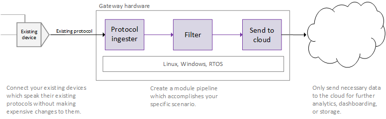

This project has adopted the [Microsoft Open Source Code of Conduct](https://opensource.microsoft.com/codeofconduct/). For more information see the [Code of Conduct FAQ](https://opensource.microsoft.com/codeofconduct/faq/) or contact [opencode@microsoft.com](mailto:opencode@microsoft.com) with any additional questions or comments

# Azure IoT Gateway SDK
IoT scenarios vary drastically between industries and even between customers within the same industry. 
The Azure IoT Gateway SDK lets you build IoT solutions tailored to your exact scenario. Connect new 
or existing devices, regardless of protocol. Process the data in an on-premises gateway using the 
language of your choice (Java, C#, Node.js, or C), before sending it to the cloud. Deploy the solution 
on hardware that meets your performance needs and runs the operating system of your choice.

In the image below an existing device has been connected to the cloud using edge intelligence. The 
on-premises gateway not only preforms protocol adaptation which allows the device to send data to the 
cloud, it also filters the data so that only the most important information is uploaded.

Using existing modules from the Azure IoT Gateway SDK ecosystem significantly reduces your development 
and maintenance costs.  Running the gateway on-premises opens up all kinds of scenarios like 
communicating between devices in real time, operating your IoT solution with an intermittent cloud 
connection, or enforcing additional security requirements.

Visit https://azure.microsoft.com/en-us/services/iot-hub/iot-gateway-sdk/ to learn more about the Azure IoT Gateway SDK. 

## SDK Modules
The following modules are available in this repository:
>| Name             | Description                                                             |
>|------------------|-------------------------------------------------------------------------|
>| ble              | Represents a Bluetooth low energy (BLE) device connected to the gateway |
>| hello_world      | Sends a "hello world" message periodically                              |
>| identitymap      | Maps MAC addresses to IoT Hub device IDs/keys                           |
>| iothub           | Sends/receives messages to/from mapped devices and IoT Hub              |
>| logger           | Writes received message content to a file                               |
>| simulated_device | Simulates a gateway-connected BLE device                                | 
>| azure_functions  | Sends message content to an Azure Function                              | 

## Featured Modules
Other people are creating modules for the gateway SDK too! See the **More information** link for 
a module to find out how to get it, who supports it, etc.
>| Name          | More information                            | Targets gateway SDK version |
>|---------------|---------------------------------------------|-----------------------------|
>| Modbus        | https://github.com/Azure/iot-gateway-modbus | 2016-11-18                  |
>| OPC-UA Client | https://github.com/Azure/iot-gateway-opc-ua | 2016-11-18                  |
>| GZip Compression (NodeJS) | https://github.com/Azure/iot-gateway-compression-gzip-nodejs | 2016-12-16                  |

We'd love to feature your module here! See our [Contribution guidelines](Contributing.md) for 
more info.

## Operating system compatibility
The SDK is designed to be used with a broad range of operating system platforms. The version 
of the Azure IoT Gateway SDK has been tested on the following operating systems:

- Ubuntu 14.04
- Ubuntu 15.10
- Yocto Linux 3.0 on Intel Edison
- Windows 10
- Wind River 7.0

## Hardware compatibility
The SDK is designed to be independent from hardware in addition to the operating system. 
Developers can power their gateways with hardware as constrained as a microcontroller to 
systems as powerful as a ruggedized server.

## Directory structure

### /doc
This folder contains general documentation for the SDK as well as step by step instructions 
for building and running the samples:

General documentation

- [Dev box setup](doc/devbox_setup.md) contains instructions for configuring your machine to 
build the Azure IoT Gateway SDK as well as instructions for configuring your machine to build 
modules written in Java, Node.js, and .NET.

API documentation can be found [here](http://azure.github.io/azure-iot-gateway-sdk/api_reference/c/html).

### /samples
This folder contains all of the samples for the Azure IoT Gateway SDK. Samples are separated 
in their own folders. Step by step instructions for building and running each sample can be found 
in the README.md file in the root of each sample's folder.

Samples include:
- [Hello World](samples/hello_world/README.md) - Learn the basic concepts of the Azure IoT 
Gateway SDK by creating a simple gateway that logs a hello world message to a file every 5 seconds.
- [Simulated Device](samples/simulated_device_cloud_upload/README.md) Send data to IoTHub from
a gateway using a simualted device instead of using a real device. 
- [Real Device](samples/ble_gateway/README.md) - Send data to IoTHub from a real device that could not
connect to the cloud unless it connected through a gateway. This sample uses a Blueetooth Low Energy 
[Texas Instruments SensorTag](http://www.ti.com/ww/en/wireless_connectivity/sensortag2015/index.html) 
as the end device .

### /modules
This folder contains all of the modules included with the Azure IoT Gateway SDK. Each module 
represents a specific piece of functionality that can be composed into an end to end gateway 
solution. Details on the implementation of each module can be found in each module's devdoc/ folder. 

### /core
This folder contains all of the core infrastructure necessary to create a gateway solution. 
In general, developers only need to *use* components in the core folder, not modify them. API 
documentation for core infrastructure can be found [here](http://azure.github.io/azure-iot-gateway-sdk/api_reference/c/html). 
Details on the implementation of core components can be found in [core/devdoc](core/devdoc).

### /build
This is the default folder that cmake will place the output from our build scripts. The developer 
always has the final say about the destinaiton of build output by creating a folder, navigating to 
it, and then running cmake from there. Detailed instructions are contained in each sample doc.
