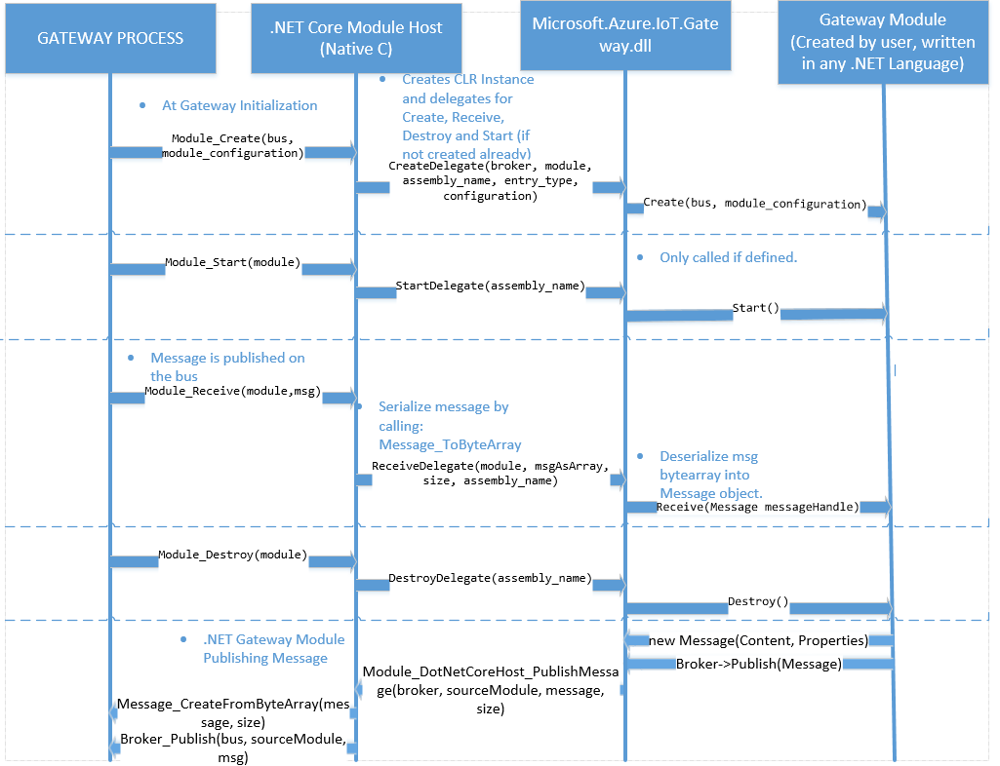

Building Azure IoT Gateway Modules in .NET Core
===============================================

Overview
--------

This document describes the high level design of the .NET Core binding mechanism used by Azure IoT Gateway SDK. 
It describes how the .NET Core CLR is hosted in the gateway process's memory and how the interaction between the
native and .NET Core Managed Modules will work.

The existing binding implementation in the Gateway SDK for .NET targets the full .NET framework (desktop and server) on Windows only. 
The binding discussed in this document relates to the cross platform open source .NET Core product that works on Windows, Linux and macOS.

Hosting .NET CLR
----------------

In order to be able to host the CLR, we are going to use the following exports from .NET Core CLR:
-coreclr_initialize;
-coreclr_create_delegate;
-coreclr_shutdown;

Some documentation on how to host the .NET CLR can be found on: 
- [.NET Core GitHub](https://github.com/dotnet/)  - Check sample `corerun` and `coreconsole` for both windows and linux.

Design
------

.NET Core Module Host
---------------------
The **.NET Core Module Host** is a C module that

1. Creates a [.NET Core](https://github.com/dotnet/) CLR instance;

2. Creates delegates for .NET Module Calls (Create, destroy, receive, start);

3. Brokers calls **from** the managed module to the message broker (dotnetHost_PublishMessage, which invokes `MessageCreate_FromByteArray` and `Broker_Publish`);

###JSON Configuration

The JSON configuration for [.NET Core](https://github.com/dotnet/)  Module will be similar to the configuration for Node and Java Module Host:

~~~~~~~~~~~~~~~~~~~~~~~~~~~~~~~~~~~~~~~~~~~~~~~~~~~~~~~~~~~~~~~~~~~~~~~~~~~ JSON
{
    "modules": [
        {
            "name": "csharp_hello_world",
            "loader": {
                "name": "dotnetcore",
                "entrypoint": {
                    "assembly.name": "mymoduleassembly",
                    "entry.type": "mycsharpmodule.classname"
                }
            },
            "args": "module configuration"            
        }
    ]
}
~~~~~~~~~~~~~~~~~~~~~~~~~~~~~~~~~~~~~~~~~~~~~~~~~~~~~~~~~~~~~~~~~~~~~~~~~~~

1. `name` is the name of the module created ([.NET Core](https://github.com/dotnet/)  Module) that will be stored by the gateway and used internally;

2. `loader` is the configuration specifically for the [.NET Core](https://github.com/dotnet/)  Loader. 

    2.1 `loader->assembly.name`: Name of the managed assembly that contains the module implementation;

    2.2 `loader->entry.type`: Fully qualified name of the managed class that implements `IGatewayModule`; 
    
3. `args`  The value of this property is used to supply configuration information specific to a given [.NET Core](https://github.com/dotnet/)  module. The value is passed as a byte[] to .NET module and it shall be converted as a UTF-8 String;

##Native methods description
### Module\_Create

When the **.NET Core Module Host**’s `Module_Create` function is invoked by the
gateway process, it:

-   Creates a CLR instance by calling `coreclr_initialize; 

-   Creates [.NET Core](https://github.com/dotnet/)  Delegates for Create, Receive, Start and Destroy;

-   Calls Create Delegate, which will call the Create method on the user [.NET Core](https://github.com/dotnet/)  Module (Module that implemented `IGatewayModule`);

### Module\_Start

When the **.NET Core Module Host**’s `Module_Start` function is invoked by the
gateway, it:

- Call the `Start` Delegate;
- Managed implementation of Start delegate checks if [.NET Core](https://github.com/dotnet/)  module has implemented the `Start` method; 
- If defined, invokes the `Start` method implemented by the [.NET Core](https://github.com/dotnet/)  module.

### Module\_Receive

When the **.NET Core Module Host**’s `Module_Receive` function is invoked by the
gateway process, it:

- Serializes (by calling `Message_ToByteArray`) the message content and properties and invokes the `Receive` method implemented by the .NET module (`IGatewayInterface` below). The .NET module will deserialize this byte array into a Message object.
- Calls the `Receive` delegate;

### Module\_Destroy

When the **.NET Module Host**’s `Module_Destroy` function is invoked by the
gateway, it:

- Calls the `Destroy` delegate (which is going to call `Destroy` method implemented by the [.NET Core](https://github.com/dotnet/)  Module); 
- Releases resources allocated;
- Calls the `coreclr_shutdown` method;

.NET Wrappers and objects
-------------------------

This is going to be a layer written in .NET that will wrap a method in our host that is responsible to publish a given message. 
For [.NET Core](https://github.com/dotnet/)  Modules the following wrappers will be provided:

1. `Message` - Object that represents a message;

2. `Broker` - Object that represents the broker, which passes messages between modules;

3. `IGatewayModule` - interface that has to be implemented by the [.NET Core](https://github.com/dotnet/)  Module; 

4. `nativeDotNetHostWrapper` - Uses DLLImport to marshal call to dotnetHost_PublishMessage. This will be transparent to the .NET User, it will be called by the Broker Class when the user calls Publish.

The high level design of these objects and interfaces is documented below:

### Message
~~~~~~~~~~~~~~~~~~~~~~~~~~~~~~~~~~~~~~~~~~~~~~~~~~~~~~~~~~~~~~~~~~~~~~~~~~ C#
    
    namespace Microsoft.Azure.IoT.Gateway
    {
        /// 
 Object that represents a message passed between modules. 

        public class Message
        {
            public byte[] Content { set; get; };
            
            public Dictionary<string,string> Properties  { set; get; };

            public Message();
            
            public Message(byte[] msgInByteArray);
            
            public Message(string content, Dictionary<string, string> properties); 
            
            public Message(Message message);
            
            public byte[] ToByteArray();
        }        
    }
~~~~~~~~~~~~~~~~~~~~~~~~~~~~~~~~~~~~~~~~~~~~~~~~~~~~~~~~~~~~~~~~~~~~~~~~~~

### Broker
~~~~~~~~~~~~~~~~~~~~~~~~~~~~~~~~~~~~~~~~~~~~~~~~~~~~~~~~~~~~~~~~~~~~~~~~~~ C#
    
    namespace Microsoft.Azure.IoT.Gateway
    {
        /// 
 Object that represents the message broker, to which messsages will be published. 

        public class Broker
        {
            /// 

            ///     Publish a message to the message broker. 
            /// 

            /// <param name="message">Object representing the message to be published to the broker.</param>
            /// <returns></returns>
            public void Publish(Message message);
        }        
    }
~~~~~~~~~~~~~~~~~~~~~~~~~~~~~~~~~~~~~~~~~~~~~~~~~~~~~~~~~~~~~~~~~~~~~~~~~~

### IGatewayModule
~~~~~~~~~~~~~~~~~~~~~~~~~~~~~~~~~~~~~~~~~~~~~~~~~~~~~~~~~~~~~~~~~~~~~~~~~~ C#
    
    /// 
 Interface to be implemented by the .NET Module 

    public interface IGatewayModule
    {
            /// 

            ///     Creates a module using the specified configuration connecting to the specified message broker.
            /// 

            /// <param name="broker">The broker to which this module will connect.</param>
            /// <param name="configuration">A byte[] with user-defined configuration for this module. This parameter shall be enconded to a UTF-8 String.</param>
            /// <returns></returns>
            void Create(Broker broker, byte[] configuration);
            
            /// 

            ///     Disposes of the resources allocated by/for this module.
            /// 

            /// <returns></returns>
            void   Destroy();

            /// 

            ///     The module's callback function that is called upon message receipt.
            /// 

            /// <param name="received_message">The message being sent to the module.</param>
            /// <returns></returns>                
            void Receive(Message received_message);                
    }
    
    /// 
 Optional Start Interface to be implemented by the .NET Module 

    public interface IGatewayModuleStart
    {

        /// 

        ///     Informs module the gateway is ready to send and receive messages.
        /// 

        /// <returns></returns>
        void Start(); 
        
    }
~~~~~~~~~~~~~~~~~~~~~~~~~~~~~~~~~~~~~~~~~~~~~~~~~~~~~~~~~~~~~~~~~~~~~~~~~~

Flow Diagram
------------

Following is the flow diagram of a lifecycle of the [.NET Core](https://github.com/dotnet/)  module: 

