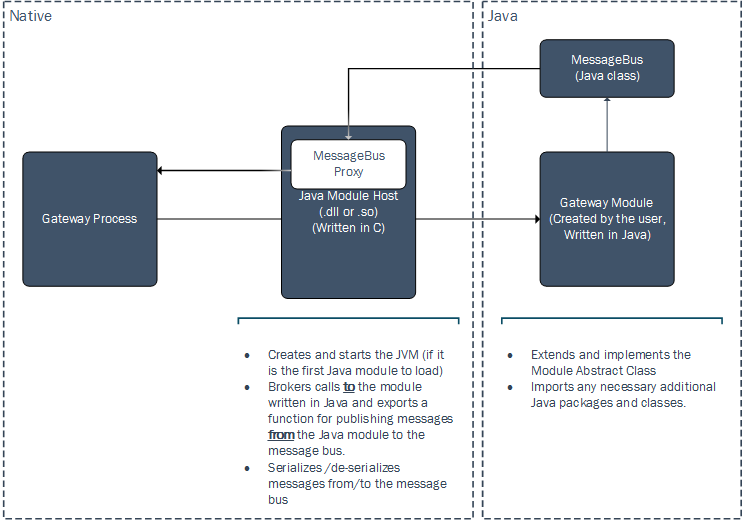

Java Binding High Level Design
==============================

Overview
--------

This document describes the high level design of the Java binding mechanism used
by the Azure IoT Gateway SDK. It details how Java modules running inside of the
JVM will interact with the native gateway core.

Design
------

Java Module Host
----------------

The **Java Module Host** is a C module that

1.  Creates the JVM (Java Virtual Machine) the first time a Java module is
    attempting to connect to the gateway.

2.  Brokers calls **to** the Java module (create, destroy, receive) and
    facilitates publishing **from** the Java module to the native Message Bus.

Because [JNI](http://docs.oracle.com/javase/8/docs/technotes/guides/jni/) (Java
Native Interface) only allows one JVM instance per process, the **Java Module
Host** will create a JVM **only once** when the first Java module is loading.
Subsequent attempts to load additional Java modules will load and run those
modules in the same JVM that was originally created. The JSON configuration for
this module will be similar to the configuration for the Node Module Host:

~~~~~~~~~~~~~~~~~~~~~~~~~~~~~~~~~~~~~~~~~~~~~~~~~~~~~~~~~~~~~~~~~~~~~~~~~~~ json
{
    "modules": [
        {
            "module name": "java_poller",
            "module path": "/path/to/java_module_host_hl.so|.dll",
            "args": {
                "class_path": "/path/to/relevant/class/files",
                "library_path": "/path/to/dir/with/java_module_host_hl.so|.dll"
                "class_name": "Poller",
                "args": {
                    "frequency": 30
                },
                "jvm_options": {
                    "version": 8,
                    "debug": true,
                    "debug_port": 9876,
                    "verbose": false,
                    "additional_options": [
                        "-Djava.version=1.8"
                    ]
                }
            }
        }
    ]
}
~~~~~~~~~~~~~~~~~~~~~~~~~~~~~~~~~~~~~~~~~~~~~~~~~~~~~~~~~~~~~~~~~~~~~~~~~~~~~~~~

As usual, the `module path` specifies the path to the DLL/SO that implements the
**Java Module Host**. The `args.class_path` specifies the path to the directory
where all necessary Java class files are located, `args.class_name` is the name
of the class that implements the module code, and finally `args.jvm_options` is
a JSON object containing any options to be passed to the JVM upon creation.

 

Gateway Module (Java)
---------------------

The **Java Module Host** will handle calling into the gateway module written in
Java when necessary, therefore each module written in Java must implement the
same `IGatewayModule` interface shown below:

~~~~~~~~~~~~~~~~~~~~~~~~~~~~~~~~~~~~~~~~~~~~~~~~~~~~~~~~~~~~~~~~~~~~~~~~~~~ java
public interface IGatewayModule {

    /**
     * The create method is called by the subclass constructor when the native 
     * Gateway creates the Module. The constructor
     * should save both the {@code moduleAddr} and {@code bus} parameters.
     *
     * @param moduleAddr The address of the native module pointer
     * @param bus The {@link MessageBus} to which this Module belongs
     * @param configuration The configuration for this module represented as a JSON
     * string
     */
    void create(long moduleAddr, MessageBus bus, String configuration);

    /**
     * The destroy method is called on a {@link GatewayModule} before it is about 
     * to be "destroyed" and removed from the gateway.
     * Once a module is removed from the gateway, it may no longer send or receive 
     * messages.
     *
     * The destroy() and receive() methods are guaranteed to not be called 
     * simultaneously.
     */
    void destroy();

    /**
     * The receive method is called on a {@link GatewayModule} whenever it receives
     * a message.
     *
     * The destroy() and receive() methods are guaranteed to not be called 
     * simultaneously.
     *
     * @param source The message content
     */
    void receive(byte[] source);
}
~~~~~~~~~~~~~~~~~~~~~~~~~~~~~~~~~~~~~~~~~~~~~~~~~~~~~~~~~~~~~~~~~~~~~~~~~~~~~~~~

To simplify this, the Azure IoT Gateway SDK provides an abstract `GatewayModule`
class which implements the `IGatewayModule` interface. Module-implementers
should extend this abstract class when creating a module.

 

Exactly like a standard gateway module written in C, the gateway will handle
making calls to `Module_Create`, `Module_Receive`, and `Module_Destroy`. These
three functions are implemented by the **Java Module Host** which handles the
communication to the gateway module written in Java. Below is a description of
what the **Java Module Host** will do in each of these cases:

### Module\_Create

When the **Java Module Host**’s `Module_Create` function is invoked by the
gateway, it:

-   Creates a JVM with the provided JVM configuration if this is the first Java
    module added to the gateway.

-   Constructs a `MessageBus` Java object using the `MESSAGE_BUS_HANDLE`.

-   Finds the module’s class with the name specified by the `args.class_name`,
    invokes the constructor passing in the native `MODULE_HANDLE` address,
    the `MessageBus` object and the JSON args string for that module, and 
    creates the Java module.

-   Gets a global reference to the newly created `GatewayModule` object to be
    saved by the `JAVA_MODULE_HOST_HANDLE`.

### Module\_Receive

When the **Java Module Host**’s `Module_Receive` function is invoked by the
gateway, it:

-   Serializes the `MESSAGE_HANDLE` content and properties and invokes the
    `receive` method implemented by the Java module with the serialized message.

### Module\_Destroy

When the **Java Module Host**’s `Module_Destroy` function is invoked by the
gateway, it:

-   Attaches the current thread to the JVM

-   Invokes the `destroy` method implemented by the Java module.

-   Deletes the global reference to the Java module object.

-   Destroys the JVM if it is the last Java module to be destroyed.

Communication **FROM** the Java module
--------------------------------------

In order to communicate **from** the Java module to the native gateway process,
the `MessageBus` class must be used. The `MessageBus` class provides a method to
publish messages onto the native Message Bus and loads a dynamic library that
implements the functions for publishing onto the native message bus. So,the 
above diagram should look a bit more like this:

