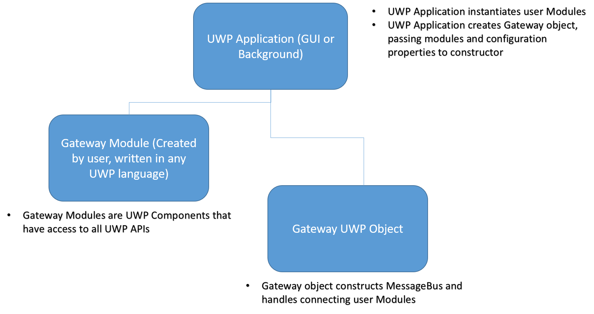
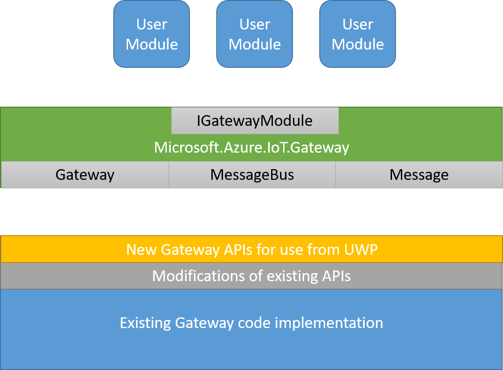

Building Azure IoT Gateway Modules for UWP
=============================================

Overview
--------

This document describes the high level design of the UWP Azure IoT Gateway SDK. 

Design
------

UWP Wrappers and objects
-------------------------

This is a layer written in UWP that wraps what is required to publish a given message. 
For UWP Modules the following wrappers will be provided:
1. `Message` - Object that represents a message;

2. `MessageBus` - Object that represents the bus, which will be used to publish messages on to the bus;

3. `IGatewayModule` - interface that has to be implemented by the .NET Module; 

4. `Gateway` - Object that represents the gateway, which will be used to construct the gateway;

The high level design of these objects and interfaces is documented below:

### Gateway
~~~~~~~~~~~~~~~~~~~~~~~~~~~~~~~~~~~~~~~~~~~~~~~~~~~~~~~~~~~~~~~~~~~~~~~~~~ C#
    
    namespace Microsoft.Azure.IoT.Gateway
    {
        /// 
 Object that represents the gateway. 

        public sealed class Gateway
        {
            public Gateway(IList<IGatewayModule> modules, IReadOnlyDictionary<string, string> configuration);
        }        
    }
~~~~~~~~~~~~~~~~~~~~~~~~~~~~~~~~~~~~~~~~~~~~~~~~~~~~~~~~~~~~~~~~~~~~~~~~~~

### Message
~~~~~~~~~~~~~~~~~~~~~~~~~~~~~~~~~~~~~~~~~~~~~~~~~~~~~~~~~~~~~~~~~~~~~~~~~~ C#
    
    namespace Microsoft.Azure.IoT.Gateway
    {
        /// 
 Object that represents a message on the message bus. 

        public sealed class Message
        {
			// There are limitations to UWP and overloading ... these static CreateMessage
			// methods are added to avoid this warning and the subsequent ambiguity issue 
			// in Javascript.
            public static Message CreateMessage(Message message);
			public static Message CreateMessage(IList<byte> content, IReadOnlyDictionary<string, string> properties);
            
            public Message(IList<byte> msgInByteArray);
            public Message(string content, IReadOnlyDictionary<string, string> properties);

            public IList<byte> GetContent();
            public IReadOnlyDictionary<string, string> GetProperties();

            public IList<byte> ToBytes();
        }        
    }
~~~~~~~~~~~~~~~~~~~~~~~~~~~~~~~~~~~~~~~~~~~~~~~~~~~~~~~~~~~~~~~~~~~~~~~~~~

### MessageBus
~~~~~~~~~~~~~~~~~~~~~~~~~~~~~~~~~~~~~~~~~~~~~~~~~~~~~~~~~~~~~~~~~~~~~~~~~~ C#
    
    namespace Microsoft.Azure.IoT.Gateway
    {
        /// 
 Object that represents the bus, to where a messsage is going to be published 

        public sealed class MessageBus
        {
            public void Publish(Message message);
        }        
    }
~~~~~~~~~~~~~~~~~~~~~~~~~~~~~~~~~~~~~~~~~~~~~~~~~~~~~~~~~~~~~~~~~~~~~~~~~~

### IGatewayModule
~~~~~~~~~~~~~~~~~~~~~~~~~~~~~~~~~~~~~~~~~~~~~~~~~~~~~~~~~~~~~~~~~~~~~~~~~~ C#
    
    /// 
 Interface to be implemented by the .NET Module 

    public interface IGatewayModule
    {
            /// 

            ///     Creates a module using the specified configuration connecting to the specified message bus.
            /// 

            /// <param name="bus">The bus onto which this module will connect.</param>
            /// <param name="configuration">A string with user-defined configuration for this module.</param>
            /// <returns></returns>
            void Create(MessageBus bus, IReadOnlyDictionary<string, string> properties);
            
            /// 

            ///     Disposes of the resources allocated by/for this module.
            /// 

            /// <returns></returns>
            void Destroy();

            /// 

            ///     The module's callback function that is called upon message receipt.
            /// 

            /// <param name="received_message">The message being sent to the module.</param>
            /// <returns></returns>                
            void Receive(Message received_message);                
    }
~~~~~~~~~~~~~~~~~~~~~~~~~~~~~~~~~~~~~~~~~~~~~~~~~~~~~~~~~~~~~~~~~~~~~~~~~~

Flow Diagram
------------

Following is the flow diagram of a lifecycle of the .NET module: 

