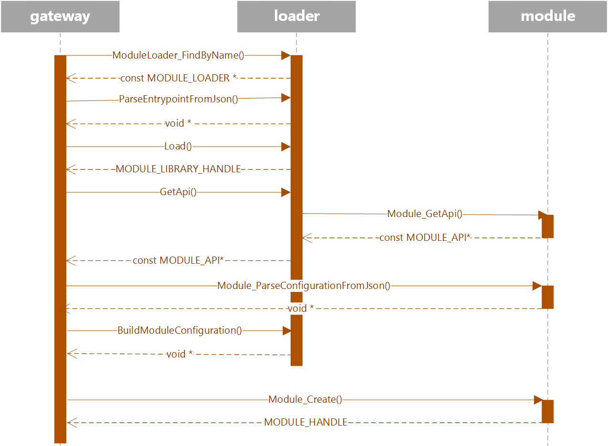

Module Loaders in the Gateway
=============================

Introduction
------------

The Gateway SDK is essentially a plugin based system that is composed of
*modules* that provide the functionality of an IoT Gateway device. One of the
design goals of the Gateway SDK is the idea that the SDK will allow for
flexibility with respect to how a module is packaged and distributed and loaded
in the gateway. A sandboxed environment like the Windows 10 Universal Windows
Platform (UWP) might choose to implement a custom module loading strategy for
example, to accommodate the constraints of that platform.

This document describes at a high level how this works. Gateway modules can be
written using different technology stacks. At the time of writing modules can be
written using C, .NET, Node.js or Java.

What is a Module Loader?
------------------------

The primary duty of a module loader in the gateway is to locate and load a
module - or in other words, to abstract away from the gateway the details of
locating and loading a module. A gateway module may be native or managed (.NET,
Node.js or Java). If it is a managed module then the loader is responsible for
ensuring that the runtime needed to successfully load and run the module is
loaded and initialized first.

From the perspective of the gateway, a module loader is a piece of code that
knows how to load a module instance and hand the gateway a table of function
pointers used to control it. The gateway doesn’t really care how the module
loader goes about acquiring the said pointers.

Loader Configuration
--------------------

A loader is defined by the following attributes:

-   **Type**: Can be *native*, *outprocess*, *java*, *node* or *dotnet*

-   **Name**: A string that can be used to reference a given loader

-   **Configuration**: Optional additional configuration parameters that may be
    used to configure the loader. A typical use case is to configure the runtime
    that is to be loaded. For example, one might specify custom runtime options
    for the Java Virtual Machine here.

When initializing a gateway from a JSON configuration file via the
`Gateway_CreateFromJson` function, the loader configuration can be specified via
the top level `loaders` array. For example:

~~~~~~~~~~~~~~~~~~~~~~~~~~~~~~~~~~~~~~~~~~~~~~~~~~~~~~~~~~~~~~~~~~~~~~~~~~~~~~ c
{
  "loaders": [
    {
      "type": "java",
      "name": "java",
      "configuration": {
          "jvm.options": {
            ... jvm options here ...
          }
      }
    },
    {
      "type": "node",
      "name": "node_loader",
      "configuration": {
          "binding.path": "/path/to/nodejs_binding.so"
      }
    }
  ],

  "modules": [
    ... modules listing goes here ...
  ]
}
~~~~~~~~~~~~~~~~~~~~~~~~~~~~~~~~~~~~~~~~~~~~~~~~~~~~~~~~~~~~~~~~~~~~~~~~~~~~~~~~

Only the `type` and `name` properties for a given loader are required values.
The `binding.path` property is optional and can be used to override the path to
the DLL/SO that implements the language binding for a language binding loader.
There may be other supported properties that are specific to a given type of
loader (like `jvm.options` above which can be used to specify the Java Virtual
Machine options to use for the Java language binding loader).

Built-in Module Loaders
-----------------------

The Gateway SDK ships with a set of loaders that support dynamically loaded
modules and language binding loaders for .NET, Node.js and Java. They can be
referenced using the following loader names:

-   `native`: This implements loading of native modules - that is, plain C
    modules.

-   `outprocess`: This implements out of process modules - that is, modules
    running in a different process on the same system.

-   `java`: This implements loading of modules implemented using the Java
    programming language and compiled to JAR files.

-   `node`: This implements loading of modules implemented using Node.js.

-   `dotnet`: This implements loading of modules implemented using a .NET
    language and compiled as a .NET assembly.

It is legal to completely omit specifying the `loaders` array in which case the
default loaders specified above will be made available using default options.
Here’s an example of a module configuration that makes use of the Java loader:

~~~~~~~~~~~~~~~~~~~~~~~~~~~~~~~~~~~~~~~~~~~~~~~~~~~~~~~~~~~~~~~~~~~~~~~~~~~~~~ c
{
  "modules": [
    {
        "name": "analyzer",
        "loader": {
            "name": "java",
            "entrypoint": {
                "class.name": "org.contoso.gateway.AnalyzerModule",
                "class.path": "./bin/analyzer.jar"
            }
        },
        "args" : null
    }
  ]
}
~~~~~~~~~~~~~~~~~~~~~~~~~~~~~~~~~~~~~~~~~~~~~~~~~~~~~~~~~~~~~~~~~~~~~~~~~~~~~~~~

How module loaders work
-----------------------

A module loader is defined using a struct called `MODULE_LOADER` that looks like
this:

~~~~~~~~~~~~~~~~~~~~~~~~~~~~~~~~~~~~~~~~~~~~~~~~~~~~~~~~~~~~~~~~~~~~~~~~~~~~~~ c
/**
 * The Module Loader.
 */
typedef struct MODULE_LOADER_TAG
{
    MODULE_LOADER_TYPE                  type;
    const char*                         name;
    MODULE_LOADER_BASE_CONFIGURATION*   configuration;
    MODULE_LOADER_API*                  api;
} MODULE_LOADER;
~~~~~~~~~~~~~~~~~~~~~~~~~~~~~~~~~~~~~~~~~~~~~~~~~~~~~~~~~~~~~~~~~~~~~~~~~~~~~~~~

`MODULE_LOADER_API` is a struct containing function pointers that has been
defined like so:

~~~~~~~~~~~~~~~~~~~~~~~~~~~~~~~~~~~~~~~~~~~~~~~~~~~~~~~~~~~~~~~~~~~~~~~~~~~~~~ c
typedef struct MODULE_LOADER_API_TAG
{
    pfModuleLoader_Load Load;

    pfModuleLoader_Unload Unload;

    pfModuleLoader_GetApi GetApi;

    pfModuleLoader_ParseEntrypointFromJson ParseEntrypointFromJson;
    pfModuleLoader_FreeEntrypoint FreeEntrypoint;

    pfModuleLoader_ParseConfigurationFromJson ParseConfigurationFromJson;
    pfModuleLoader_FreeConfiguration FreeConfiguration;

    pfModuleLoader_BuildModuleConfiguration BuildModuleConfiguration;
    pfModuleLoader_FreeModuleConfiguration FreeModuleConfiguration;
} MODULE_LOADER_API;
~~~~~~~~~~~~~~~~~~~~~~~~~~~~~~~~~~~~~~~~~~~~~~~~~~~~~~~~~~~~~~~~~~~~~~~~~~~~~~~~

Module loaders for a given language binding may or may not be available
depending on the *CMake* build options that were used when the source was built.
For example if CMake was run with the `enable_dotnet_binding` variable set to
`false`/`off` then the corresponding loader becomes unavailable for use.

Every module loader implementation provides a global function that is
responsible for returning a pointer to a `MODULE_LOADER` instance. The *native*
loader that implements dynamic module loading for instance might provide a
function that looks like this:

~~~~~~~~~~~~~~~~~~~~~~~~~~~~~~~~~~~~~~~~~~~~~~~~~~~~~~~~~~~~~~~~~~~~~~~~~~~~~~ c
extern const MODULE_LOADER *DynamicLoader_Get(void);
~~~~~~~~~~~~~~~~~~~~~~~~~~~~~~~~~~~~~~~~~~~~~~~~~~~~~~~~~~~~~~~~~~~~~~~~~~~~~~~~

The gateway, during initialization, creates and populates a vector of
`MODULE_LOADER` instances so that it has a default set of module loaders to work
with. As discussed before, the gateway SDK, depending on build options used will
ship with a set of pre-defined loaders. Here’s an example how this
initialization code might look like:

~~~~~~~~~~~~~~~~~~~~~~~~~~~~~~~~~~~~~~~~~~~~~~~~~~~~~~~~~~~~~~~~~~~~~~~~~~~~~~ c
MODULE_LOADER* module_loaders[] = {
    DynamicLoader_Get()

    #ifdef JAVA_BINDING_ENABLED
    , JavaBindingLoader_Get()
    #endif

    #ifdef DOTNET_BINDING_ENABLED
    , DotnetBindingLoader_Get()
    #endif

    #ifdef NODE_BINDING_ENABLED
    , NodeBindingLoader_Get()
    #endif

    , OutprocessLoader_Get()
};
~~~~~~~~~~~~~~~~~~~~~~~~~~~~~~~~~~~~~~~~~~~~~~~~~~~~~~~~~~~~~~~~~~~~~~~~~~~~~~~~

The gateway maintains a global vector of `MODULE_LOADER` instances to store the
list of module loaders that the gateway might want to make use of.

### Loading Loaders

The process of initializing the list of loaders that a gateway is configured to
work is given below:

1.  Initialize the list of default loaders based on what has been compiled into
    the gateway as described in the previous section.

2.  Inspect the gateway configuration and create custom loaders. When
    initializing from JSON, if a loader’s name matches the name of an existing
    loader then it has the effect of replacing the loader’s configuration. New
    loaders are added to the gateway’s loaders list (the loader’s function
    pointer table is copied over from the corresponding *default* loader with
    the same loader type).

3.  When initializing from JSON, each loader’s configuration is parsed by
    invoking the `ParseConfigurationFromJson` function from the loader’s API.

### Loading Modules

The process of loading a given gateway module is described below:

1.  When initializing the gateway from JSON, it first attempts to parse the
    module’s entrypoint data by calling the loader’s `ParseEntryPointFromJson`
    function.

2.  It then proceeds to load the module by invoking the loader’s `Load` function
    passing in the entrypoint it acquired in the previous step. Each loader is
    free to do what it needs to in order to load the module. The native loader
    for example will inspect the entrypoint to retrieve the path to the DLL/SO
    that implements the module and loads it into memory. A language binding
    module’s loader on the other hand might choose to load the binding module
    implementation and it’s associated runtime and defer the loading of the
    actual module code till the time when `Module_Create` is called on the
    binding module.

3.  Next, when the gateway is loaded from JSON, the module’s `args` JSON is
    parsed by invoking `ParseConfigurationFromJson` on the module’s API.

4.  Language binding modules expect a configuration structure that’s typically
    an amalgamation of the entrypoint data and the module loader’s
    configuration. In order to provide language binding modules an opportunity
    to perform this merging of configuration information, the loader is expected
    to implement the `BuildModuleConfiguration` function. This function is
    provided with pointers to the entrypoint data and the module loader’s
    configuration and it returns a pointer to a merged variant of the
    configuration as expected by the binding module.

5.  Finally, the `Module_Create` API is called on the module itself at which
    point the module is loaded.
