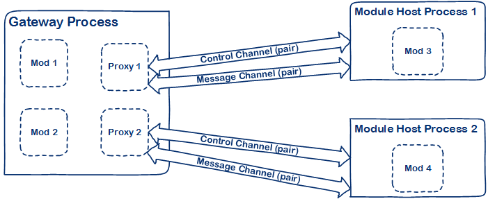
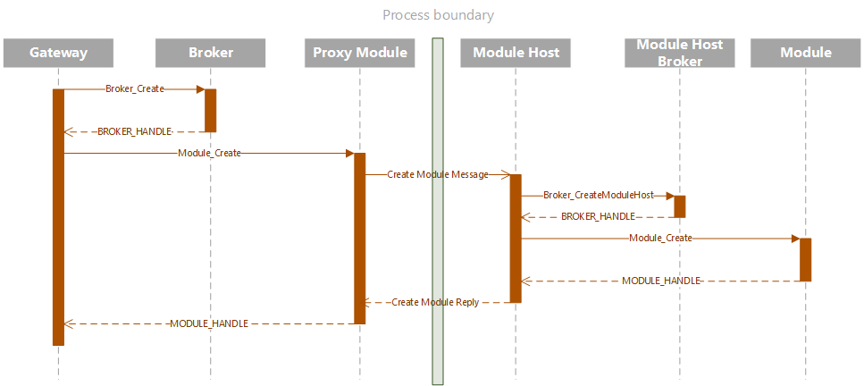
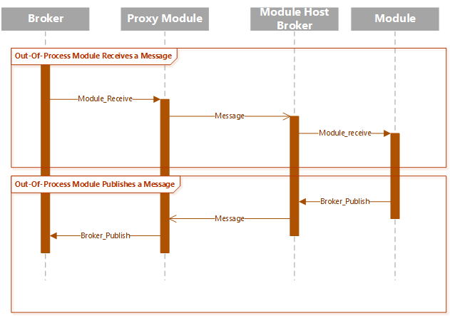
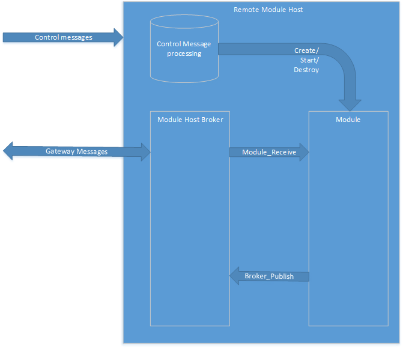

On out process gateway modules
==============================

Introduction
------------

All modules in the gateway are hosted within the gateway process today. While
this makes for great performance it is also at the cost of execution isolation
between modules, i.e., one misbehaving module can potentially affect the
behavior of other modules or the gateway itself. This document seeks to propose
a design for implementing gateway modules that are hosted in external processes.
These processes will run intially on the same device that the gateway is 
running on, with the option of extending this behavior to remote devices.

The outprocess module is applicable for a customer that already has device 
telemetry and control in another process, and wants to send that telemetry data 
to the gateway with a minimum of new code.

Design Goals
------------

One design goal is the notion that developers who are implementing modules
should be able to take a working module as is and host the module in a process
outside the gateway process. All the complexities of activation and
inter-process communication should be transparently handled by the gateway
framework.

Another design goal is to enable the implementation of module host 
processes in popular programming languages and technology stacks. This is 
will be achieved by specifying the serialized gateway and control 
messages and enumerating the expectations of a module host implementation.

Design Non-goals
----------------

It is possible that an outprocess module, due to implementation issues (aka 
bugs), becomes unstable and precipitates a process hang or termination. The 
scope of this document does not cover these recovery scenarios. It is assumed that mechanisms external to the gateway will be used for this purpose at this 
time.

Design Overview
---------------



The Gateway will still consist of the gateway, broker and modules, seen above as the "Gateway Process."  To implement the out of process modules, the gateway process will now have a proxy module which will forward control and data to a module host process.

As an example of control flow from the Gateway to the Module host, this is an elided sequence diagram for outprocess module creation:



NOTE: The call to the out of process module will be a synchronous call.

Message passing from the gateway to an outprocess module will look like this:


 
### Inter-process Communication

Inter-process communication between the gateway process and the process
hosting the module will be managed using **nanomsg** 
[request/reply](http://nanomsg.org/v1.0.0/nn_reqrep.7.html) sockets for 
control, and **nanomsg** [Pair](http://nanomsg.org/v1.0.0/nn_pair.7.html) 
sockets for messaging. The gateway will create `NN_REQ` and `NN_PAIR` sockets 
for each external process. The module host will create `NN_RESP` and `NN_PAIR` 
sockets. The module host is a service to the gateway, but gateway content 
(messages) is sent as peers. The control channel identifier must be given to the 
module host process, possibly as a command line argument, and the remaining 
configuration for the outprocess module is provided through the control 
channel. (See 
[Proxy/Module Host Control Communication Protocol](#control_communication) for 
more details.)

Why choose to split out the control messages from the gateway messages?  If you 
look at the [Gateway Block Diagram](./media/Gateway_block.xsdx), there are 
module control functions the gateway performs, and the message receive and 
publish functions that the broker performs. In order to leverage as much 
existing gateway library code as is possible, it made the most sense to give 
the broker proxy in the module host process gateway messages, and hand control 
messages to the module host process.

This diagram shows which entities will handle the control channel, which is 
analogous to the gateway block diagram.



The broker proxy in the module host process communicates via the gateway messages, 
while the module host process communicates to the gateway on the control channel.

At a minimum, a module host process needs to: monitor the control channel, 
process control channel messages (including module management), provide a 
Broker for publishing gateway messages and monitor the message channel for 
gateway messages. The current design allows for any implementation of a module 
host to function independent of the gateway process as long as the host 
correctly implements the communication protocol for control messages and 
messages delivered to/from the broker. (See 
[the control channel communication section](control_communication) for details 
on the control channel.)

For the purposes of this document we will only describe connecting to modules 
using the ipc transport provided in *nanomsg*. This will be the default 
transport for outprocess modules when a URI is not given. *Nanomsg* supports TCP,
but it is currently not secured and therefore not recommended until a secure transport is available.

Proxy Module
------------

The first piece of the puzzle is a gateway module (i.e., it implements
`MODULE_API`) that we shall call the *proxy* module. The job of the proxy 
module is to abstract from the rest of the gateway the fact that the module in 
question is running outside the gateway process, i.e., as far as the rest of 
the gateway is concerned, the out-proc module is no different from the garden 
variety in-proc module. The proxy module’s out-proc counterpart is a *hosting 
process* that is responsible for running the outprocess module in question and 
broker communication between that module and the gateway.

This is a brief description of the repsonsibilies of the proxy module.

-   **Module_ParseConfigurationFromJson**
    The proxy module will serialize the arguments into a JSON string.

-   **Module_FreeConfiguration**
    The proxy module will free the serialized string.

-   **Module_Create**
    The proxy Module will format a _Create Module_ request and send it via the 
    control channel to the outprocess module, it will wait for a response 
    before returning.

-   **Module_Destroy**
    The proxy Module will format a _Destroy Module_ message and send it via the control channel to the outprocess module. It will not wait for a response.

-   **Module_Receive**
    The proxy module will serialize the message and send it via the message channel to the outprocess module.

-   **Module_Start**
    The proxy module will format a _Start Module_ message and send it via the control channel to the outprocess module.

-   The proxy module will also create a task to read any gateway messages 
    published from the remote module.

The proxy module will require a new loader type, an outprocess module loader.

Outprocess Module loader
-------------------

The proxy module will be loaded by a new "outprocess" module loader type. This will be responsible for providing the proxy module API to the gateway.

There is no configuration for the proxy module loader.

The proxy module connection information is placed in the "entrypoint" for the loader.

This is an example of what the "loaders" entry will look like this:
```JSON
"loaders" : [
    { 
        "type" : "outprocess",
        "name" : "outprocess"
    }
]
```

and an example of how the proxy module will be loaded :

```JSON
"modules" : [
{ 
    "name" : "outprocess_module",
    "loader" : {
        "name" : "outprocess"
        "entrypoint" : {
            "activation.type" : "none",
            "control.id" : "outprocess_module_control",
            "message.id" : "outprocess_module_message",
            }
        }
    }
    "args" : {...}
}
]
```

### Proxy Module Configuration

The proxy module’s configuration will include the following information:

-   **Control channel ID**

    The proxy module will use a control channel to send control information to 
    the module host process. This is a required argument. The identifier is any 
    string that uniquely identifies the control channel. Duplicate strings will 
    cause the module creation to fail.

-    **Message ID**

    The proxy module will send and receive gateway messages on sockets attached 
    to this ID. This is optional in the module's JSON configuration. The 
    identifier must be a unique string that identifies the message channel. 
    Duplicate strings will cause the module creation to fail. If the 
    ID is not set, the message channel URI will be composed from a UUID.

-   **Activation Type**

    This is an enumeration with values indicating how the hosting process will
    be activated. It could indicate one of the following possible values:

    -   **None:** An activation type of **None** indicates that the proxy module
        does not have to do anything in particular to *activate* the module. The
        expectation is that out-of-band measures will be adopted to ensure that
        the out-proc module will be activated.

    -   **Fork:** An activation type of **Fork** means that the proxy module
        will attempt to fork the hosting process when the module is initialized.
        The proxy will wait for a fixed duration in order to let the outprocess
        process complete initialization and start listening on it’s `NN_RESP`
        socket. Additional context information is supplied as part of the
        configuration:

        -   *Host Path*: Path to the executable that will host the module in
            question
        -   *Arguments*: array of command line arguments, if any.

    -   **Service:** This activation type indicates that the module host is a
        service and the proxy is expected to *start* the service during
        initialization. The configuration might indicate whether this is an
        *upstart* or *systemd* or a Windows system service.

    -   **Container:** This activation type indicates that the out-proc module
        is hosted in a Docker container and needs to be started during
        initialization.

-   **Module Configuration**

    The "args" of the module entry is serialized as a JSON for transmission on 
    the control channel. Once handed off to the module host, this module 
    configuration is expected to be passed to the 
    Module_ParseConfigurationFromJson function of the MODULE_API.

The first **activation type** to implement is **None**.

The proxy module will create a *nanomsg* `NN_PAIR` socket and listen for 
gateway messages on it. It will also create an `NN_REQ` socket and connect to 
the control channel. Once a connection with the module host process has been 
established communication will commence as explained later in this document.

Module Host
-----------

The module host is a function whose primary responsibility 
is to load the single gateway module in question and manage communication 
between the module and the gateway process. It is passed the control channel 
identifier as an argument. The module host then proceeds to do the following:

1. Create and open a control channel as a request/reply connection.
2. Wait for a _Create Module_ message.
3. When a _Create Module_ message arrives,

        1. Read the args from the _Create Module_ message.
        2. Create the module host broker.
        3. Create the module using the args from the _Create Module_ message.
        4. Add module to the module host broker.
        5. Send a response with success or failure.

4. Wait for a _Module Start_ message.
5. When a _Module Start_ message arrives, 

        1. call `Module_Start`, if defined.

6. Wait for a _Module Destroy_ message.
7. If a _Module Destroy_ message arrives,

        1. Remove module from module host broker.
        2. Destroy module.

Once the module host has received a _Module Destroy_ message, the module host execution is complete.

The gateway will provide a native module host which will execute the entire lifecycle of the module as described above, and return once the module fails or is destroyed. This function may be the main execution loop of a process, or spawned in a thread of a larger application.

Module Host Broker
------------------

A module requires a `BROKER_HANDLE` to publish messages, and so the module host 
process will have to create a broker for the module to use. The broker, 
as it is operating in the gateway, will not work for a module host, we 
will need to tell the broker to operate differently when running in a module 
host process. In order to distinguish this module host behavior from the 
gateway behavior, the module host will call a new create function, 
`Broker_CreateModuleHost`. Once the module host broker is created, the module 
host may add the module via `Broker_AddModule`.

There are some behavioral differences between a gateway broker and a module host broker:

-   When a module host broker is created, only one module may be added to the broker. 
-   There is no routing in the module host. All messages published by the outprocess module are sent to the module's proxy counterpart in the gateway.
-   The module host broker's `publish_socket` and the outprocess module's `receive_socket` are endpoints derived from the `NN_PAIR` messaging socket.

Native Module Host
------------------

In order to support loading native modules as a shared library (the first design goal), the module host will require both loader arguments and module arguments.

The "args" for a Native Host Module will look like the following:
```JSON
"args" : {
    "outprocess.loader" : {
        "name": "native",
        "entrypoint": {
        "module.path": "..\\..\\..\\modules\\azure_functions\\Debug\\azure_functions.dll"
    },
    "module.arguments" : {
        "hostname": "<YourHostNameHere from Functions Portal>",
        "relativePath": "api/<YourFunctionName>",
        "key": "<your Api Key Here>"
    }
}
```

An outprocess module declared in the gateway will look like:

```JSON
"modules" : [
{ 
    "name" : "outprocess_azure_function",
    "loader" : {
        "name" : "outprocess"
        "entrypoint" : {
            "activation.type" : "none",
            "control.id" : "outprocess_azure_module_control",
            }
        }
    }
    "args" : {
        "outprocess.loader" : {
            "name": "native",
            "entrypoint": {
            "module.path": "..\\..\\..\\modules\\azure_functions\\Debug\\azure_functions.dll"
        },
        "module.arguments" : {
            "hostname": "<YourHostNameHere from Functions Portal>",
            "relativePath": "api/<YourFunctionName>",
            "key": "<your Api Key Here>"
        }
    }
}
]
```

Proxy/Module Host Control Communication Protocol
------------------------------------------------

<a name="control_communication" ></a>
The proxy and the module host communicate via *messages* using *nanomsg*
request/reply sockets. The different message types and how they work has been
described below. The ordering of the message types given below corresponds
roughly with the sequence in which these messages are sent and received. Each
message packet is structured like so:


-   **Create Module Request**

    This message is sent by the proxy to the module host after it establishes a
    socket connection. The data content will be as follows:
    ```c
    struct 
        {
        const uint32_t uri_type;
        const uint32_t uri_size;
        const uint8_t  message_channel_uri[uri_size];
    } MESSAGE_URI;

    const uint8_t gateway_message_version;
    MESSAGE_URI  uri;
    const uint32_t args_size;
    const char     args[arg_size];
    ```

    where
    >| Field                   | Description   |
    >|-------------------------|---------------|
    >| gateway_message_version | The version of gateway messages being sent |
    >| uri_type                | Implementation specific URI type. (e.g NN_PAIR) |
    >| message_channel_uri     | The message channel URI, for the socket which the proxy and outprocess module exchange gateway messages. |
    >| uri_size                | Size of the messaging URI. |
    >| args                    | Serialized JSON string of module arguments. |
    >| args_size               | Size of the module arguments. |


-   **Create Module Reply**

    This message is sent by the module host in response to a *Create Module*
    request from the proxy. The *data* in the packet is a boolean status
    indicating whether the module creation was successful or not.

-   **Start Module Request**

    This message is sent by the proxy to the module host when `Module_Start` is called on the proxy module. 

-   **Heartbeat Request**

    Reserved for future use, this message will be sent by the proxy to the 
    module host when it wants to confirm the module host is still running.

-   **Heartbeat Reply**

    Reserved for future use, this message will be sent by the module host to 
    the proxy in repsonse to the heartbeat request. 

-   **Destroy Module Request**

    This message is sent by the proxy to the module host when the module is
    being shut down. There is no *data* associated with this message and no
    reply is expected to be sent by the module host. The module host is expected
    to invoke `Module_Destroy` on the module and quit the process.

Open Questions
--------------

1.  If the module host process unexpectedly terminates, the proxy does not
    currently attempt to restart it. Should we include this ability in the
    design?

2.  If the gateway process unexpectedly terminates, there could be orphan module
    host processes lying around. Should we handle this case?

3.  What would be a good timeout for the proxy when it is sitting around waiting
    for the module host to get its act together? If there is a timeout or a
    connection failure, should the proxy retry the connection? If yes, how many
    times? Should it implement exponential back-off?

5.  The message serialization format is expected to be cross-platform. Is this
    actually the case? Has this been tested?

Alternate Approach - Reusing Broker’s Nanomsg Socket
----------------------------------------------------

The topic based routing implementation of the message broker today uses a
*nanomsg* socket for supporting publish/subscribe communication semantics. Given
that there is already a *nanomsg* socket, the idea is to explore whether we can
simply tack-on a TCP (or IPC) transport endpoint to it and communicate directly
with it from the module host. While this approach works it does not appear to
obviate the need for:

1.  Having a *proxy* module that represents the module being hosted in the
    external process because we’d still need a way of *activating* the outprocess
    module which, with a proxy module, we could implement from the
    `Module_Create` API.

2.  Establishing a separate *control* channel between the proxy module and the
    module host process since the proxy will still need to communicate the
    following information to the module host:

    1.  The *nanomsg* endpoint URI at which the broker is listening for messages

    2.  The topic name to use for publishing messages to the broker

    3.  The topic names that the out of process module should subscribe to

    If the activation type chosen is *fork*, then we might conceivably pass this
    information via the command line. If other activation types were chosen
    however then we would need to have a control channel to pass this
    configuration data. Also, even when the activation type is *fork*, when the
    Gateway SDK gains the ability to dynamically add new modules, new
    subscriptions that may now be in effect will need to be passed to the out of process module which, again, requires that there be a control channel 
    which can be used for this purpose.

This approach also requires that the broker use topic names for each module read
from configuration instead of using pointer values as it currently does. This is
needed so that the module host knows what topic to publish to when the module
calls `Broker_Publish`.

With this approach we discover that the module host ends up having to
re-implement a non-trivial portion of the broker in it’s *proxy broker*
implementation. It will for instance, need to re-implement the message loop that
reads from the *nanomsg* subscribe socket, strip out the topic name from the
message and deserialize and deliver the message to the module. Similarly, when
the module calls `Broker_Publish` the proxy broker will need to serialize the
message into a byte array and prefix it with the correct topic name. All of this
is functionality that the broker in the gateway already implements.

The take away appears to be that while this can be made to work, having a
separate proxy module and control channel seems to lend itself to a cleaner,
more natural implementation.