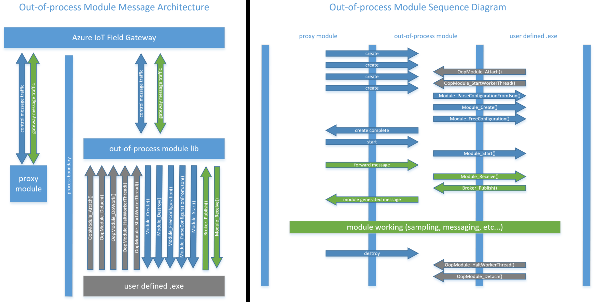

Module Requirements
===================

## Overview

This is the documentation for an out-of-process module that communicates with
other modules through the Azure IoT Gateway. Out-of-process modules need to
implement the well defined Module Interface. Each out-of-process module will
additionally need to attach and detach from the gateway and will either need
to manage the worker thread manually or use the convenience methods supplied
to start and halt the worker thread.

## References

[Azure IoT Gateway Module Interface](module.md)



## Exposed Types

```c
typedef struct OOP_MODULE_TAG * OOP_MODULE_HANDLE;
```

## Exposed API

### OopModule_Attach

`OopModule_Attach` will provide the OopModule library with the caller's
"Module API" and the connection id required to communicate with the Azure
IoT Gateway. When `OopModule_Attach` is called the OopModule library will
begin listening for the gateway create message. Once the create message is
received the OopModule library will call `Module_ParseConfigurationFromJson`^,
`Module_Create` and `Module_FreeConfiguration`^.
*^ Assuming the optional API has been provided.*

```c
extern GATEWAY_EXPORT
OOP_MODULE_HANDLE
OopModule_Attach (
    const MODULE_API * module_apis,
    const char * const connection_id
);
```

**SRS_OOP_MODULE_027_000: [** *Prerequisite Check* - If the `module_apis` parameter is `NULL`, then `OopModule_Attach` shall do nothing and return `NULL` **]**  
**SRS_OOP_MODULE_027_001: [** *Prerequisite Check* - If the `module_apis` version is greater than 1, then `OopModule_Attach` shall do nothing and return `NULL` **]**  
**SRS_OOP_MODULE_027_002: [** *Prerequisite Check* - If the `module_apis` interface fails to provide `Module_Create`, then `OopModule_Attach` shall do nothing and return `NULL` **]**  
**SRS_OOP_MODULE_027_003: [** *Prerequisite Check* - If the `module_apis` interface fails to provide `Module_Destroy`, then `OopModule_Attach` shall do nothing and return `NULL` **]**  
**SRS_OOP_MODULE_027_004: [** *Prerequisite Check* - If the `module_apis` interface fails to provide `Module_Receive`, then `OopModule_Attach` shall do nothing and return `NULL` **]**  
**SRS_OOP_MODULE_027_005: [** *Prerequisite Check* - If the `connection_id` parameter is `NULL`, then `OopModule_Attach` shall do nothing and return `NULL` **]**  
**SRS_OOP_MODULE_027_006: [** *Prerequisite Check* - If the `connection_id` parameter is longer than `GATEWAY_CONNECTION_ID_MAX`, then `OopModule_Attach` shall do nothing and return `NULL` **]**  
**SRS_OOP_MODULE_027_007: [** `OopModule_Attach` shall allocate the memory required to support its instance data **]**  
**SRS_OOP_MODULE_027_008: [** If memory allocation fails for the instance data, then `OopModule_Attach` shall return `NULL` **]**  
**SRS_OOP_MODULE_027_009: [** `OopModule_Attach` shall allocate the memory required to formulate the connection string to the Azure IoT Gateway **]**  
**SRS_OOP_MODULE_027_010: [** If memory allocation fails for the connection string, then `OopModule_Attach` shall free any previously allocated memory and return `NULL` **]**  
**SRS_OOP_MODULE_027_011: [** `OopModule_Attach` shall create a socket for the Azure IoT Gateway command channel by calling `int nn_socket(int domain, int protocol)` with `AF_SP` as the `domain` and `NN_REP` as the `protocol` **]**  
**SRS_OOP_MODULE_027_012: [** If unable to create a socket to the command channel, then `OopModule_Attach` shall free any previously allocated memory and return `NULL` **]**  
**SRS_OOP_MODULE_027_013: [** `OopModule_Attach` shall connect to the Azure IoT Gateway command channel by calling `int nn_connect(int s, const char * addr)` with the newly created socket as `s` and the newly formulated connection string as `addr` **]**  
**SRS_OOP_MODULE_027_014: [** If unable to connect to the command channel, then `OopModule_Attach` shall free any previously allocated memory and return `NULL` **]**  
**SRS_OOP_MODULE_027_015: [** If no errors are encountered, then `OopModule_Attach` shall return a handle to the OopModule instance **]**  


### OopModule_Detach

`OopModule_Detach` will cease to interact with the Azure IoT Gateway and
clean up all resources required to maintain the connection with the gateway.

```c
extern GATEWAY_EXPORT
void
OopModule_Detach (
    OOP_MODULE_HANDLE oop_module
);
```

**SRS_OOP_MODULE_027_056: [** *Prerequisite Check* - If the `oop_module` parameter is `NULL`, then `OopModule_Detach` shall do nothing **]**  
**SRS_OOP_MODULE_027_057: [** If the worker thread is active, then `OopModule_Detach` shall attempt to halt the worker thread **]**  
**SRS_OOP_MODULE_027_058: [** `OopModule_Detach` shall create the out-of-process module by calling `MODULE_HANDLE Module_Create(BROKER_HANDLE broker, const void * configuration)` using the `oop_module_handle` as `broker` and the parsed configuration value or `CONTROL_MESSAGE_MODULE_CREATE::args` as `configuration` **]**  
**SRS_OOP_MODULE_027_059: [** If unable to halt the worker thread, `OopModule_Detach` shall forcibly free the memory allocated to the worker thread **]**  
**SRS_OOP_MODULE_027_060: [** `OopModule_Detach` shall attempt to notify the Azure IoT Gateway of the detachment **]**  
**SRS_OOP_MODULE_027_061: [** `OopModule_Detach` shall disconnect from the Azure IoT Gateway message channels **]**  
**SRS_OOP_MODULE_027_062: [** `OopModule_Detach` shall shutdown the Azure IoT Gateway control channel by calling `int nn_shutdown(int s, int how)` **]**  
**SRS_OOP_MODULE_027_063: [** `OopModule_Detach` shall close the Azure IoT Gateway control socket by calling `int nn_close(int s)` **]**  
**SRS_OOP_MODULE_027_064: [** `OopModule_Detach` shall free the remaining memory dedicated to its instance data **]**  


### OopModule_DoWork

`OopModule_DoWork` is intended to provide the caller with fine-grain control of work
scheduling, and is provided as an alternative to calling `OopModule_StartWorkerThread`.
`OopModule_DoWork` is a non-blocking call, wherein each call will check for one message
on the command and each message channel connected to the Azure IoT Gateway. In other
words, if multiple messages are queued on a single channel, only the first message of
each channel will be serviced. If the message is intended for the out-of-process module
(as opposed to the OopModule library itself), the OopModule library will pass it along
by calling `Module_Receive` on the out-of-process module.

*NOTE: If `OopModule_StartWorkerThread` has been called, then calling `OopModule_DoWork`
will have no observable effect.*

```c
extern GATEWAY_EXPORT
void
OopModule_DoWork (
    OOP_MODULE_HANDLE oop_module
);
```

**SRS_OOP_MODULE_027_025: [** *Prerequisite Check* - If the `oop_module` parameter is `NULL`, then `OopModule_DoWork` shall do nothing] */
**SRS_OOP_MODULE_027_026: [** *Control Channel* - `OopModule_DoWork` shall poll the gateway control channel by calling `int nn_recv(int s, void * buf, size_t len, int flags)` with the control socket for `s`, `NULL` for `buf`, `NN_MSG` for `len` and NN_DONTWAIT for `flags` **]**  
**SRS_OOP_MODULE_027_027: [** *Control Channel* - If no message is available or an error occurred, then `OopModule_DoWork` shall abandon the control channel request **]**  
**SRS_OOP_MODULE_027_028: [** *Control Channel* - If a control message was received, then `OopModule_DoWork` will parse that message by calling `CONTROL_MESSAGE * ControlMessage_CreateFromByteArray(const unsigned char * source, size_t size)` with the buffer received from `nn_recv` as `source` and return value from `nn_recv` as `size` **]**  
**SRS_OOP_MODULE_027_029: [** *Control Channel* - If unable to parse the control message, then `OopModule_DoWork` shall free any previously allocated memory and abandon the control channel request **]**  
**SRS_OOP_MODULE_027_030: [** *Control Channel* - If the message type is CONTROL_MESSAGE_TYPE_MODULE_CREATE, then `OopModule_DoWork` shall process the create message **]**  
**SRS_OOP_MODULE_027_031: [** *Control Channel* - If unable process the create message, `OopModule_DoWork` shall return a non-zero value **]**  
**SRS_OOP_MODULE_027_032: [** *Control Channel* - If the message type is CONTROL_MESSAGE_TYPE_MODULE_START and `Module_Start` was provided, then `OopModule_DoWork` shall call `void Module_Start(MODULE_HANDLE moduleHandle)` **]**  
**SRS_OOP_MODULE_027_033: [** *Control Channel* - If the message type is CONTROL_MESSAGE_TYPE_MODULE_DESTROY, then `OopModule_DoWork` shall call `void Module_Destroy(MODULE_HANDLE moduleHandle)` **]**  
**SRS_OOP_MODULE_027_034: [** *Control Channel* - `OopModule_DoWork` shall free the resources held by the parsed control message by calling `void ControlMessage_Destroy(CONTROL_MESSAGE * message)` using the parsed control message as `message` **]**  
**SRS_OOP_MODULE_027_035: [** *Control Channel* - `OopModule_DoWork` shall free the resources held by the gateway message by calling `int nn_freemsg(void * msg)` with the resulting buffer from the previous call to `nn_recv` **]**  
**SRS_OOP_MODULE_027_036: [** *Message Channel* - `OopModule_DoWork` shall poll each gateway message channel by calling `int nn_recv(int s, void * buf, size_t len, int flags)` with each message socket for `s`, `NULL` for `buf`, `NN_MSG` for `len` and NN_DONTWAIT for `flags` **]**  
**SRS_OOP_MODULE_027_037: [** *Message Channel* - If no message is available or an error occurred, then `OopModule_DoWork` shall abandon the message channel request **]**  
**SRS_OOP_MODULE_027_038: [** *Message Channel* - If a module message was received, then `OopModule_DoWork` will parse that message by calling `MESSAGE_HANDLE Message_CreateFromByteArray(const unsigned char * source, int32_t size)` with the buffer received from `nn_recv` as `source` and return value from `nn_recv` as `size` **]**  
**SRS_OOP_MODULE_027_039: [** *Message Channel* - If unable to parse the module message, then `OopModule_DoWork` shall free any previously allocated memory and abandon the message channel request **]**  
**SRS_OOP_MODULE_027_040: [** *Message Channel* - `OopModule_DoWork` shall pass the structured message to the module by calling `void Module_Receive(MODULE_HANDLE moduleHandle)` using the parsed message as `moduleHandle` **]**  
**SRS_OOP_MODULE_027_041: [** *Message Channel* - `OopModule_DoWork` shall free the resources held by the parsed module message by calling `void Message_Destroy(MESSAGE_HANDLE * message)` using the parsed module message as `message` **]**  
**SRS_OOP_MODULE_027_042: [** *Message Channel* - `OopModule_DoWork` shall free the resources held by the gateway message by calling `int nn_freemsg(void * msg)` with the resulting buffer from the previous call to `nn_recv` **]**  


### OopModule_HaltWorkerThread

`OopModule_HaltWorkerThread` will signal and join the message thread. Once this
method has been invoked, no more messages will be received from the Azure IoT
Gateway without manually calling `OopModule_DoWork`.

```c
extern GATEWAY_EXPORT
int
OopModule_HaltWorkerThread (
    OOP_MODULE_HANDLE oop_module
);
```

**SRS_OOP_MODULE_027_043: [** *Prerequisite Check* - If the `oop_module` parameter is `NULL`, then `OopModule_HaltWorkerThread` shall return a non-zero value **]**  
**SRS_OOP_MODULE_027_044: [** *Prerequisite Check* - If a worker thread does not exist, then `OopModule_HaltWorkerThread` shall return a non-zero value **]**  
**SRS_OOP_MODULE_027_045: [** `OopModule_HaltWorkerThread` shall obtain the thread mutex in order to signal the thread by calling `LOCK_RESULT Lock(LOCK_HANDLE handle)` **]**  
**SRS_OOP_MODULE_027_046: [** If unable to obtain the mutex, then `OopModule_HaltWorkerThread` shall return a non-zero value **]**  
**SRS_OOP_MODULE_027_047: [** `OopModule_HaltWorkerThread` shall release the thread mutex upon signalling by calling `LOCK_RESULT Unlock(LOCK_HANDLE handle)` **]**  
**SRS_OOP_MODULE_027_048: [** If unable to release the mutex, then `OopModule_HaltWorkerThread` shall return a non-zero value **]**  
**SRS_OOP_MODULE_027_049: [** `OopModule_HaltWorkerThread` shall halt the thread by calling `THREADAPI_RESULT ThreadAPI_Join(THREAD_HANDLE handle, int * res)` **]**  
**SRS_OOP_MODULE_027_050: [** If unable to join the thread, then `OopModule_HaltWorkerThread` shall return a non-zero value **]**  
**SRS_OOP_MODULE_027_051: [** `OopModule_HaltWorkerThread` shall free the thread mutex by calling `LOCK_RESULT Lock_Deinit(LOCK_HANDLE handle)` **]**  
**SRS_OOP_MODULE_027_052: [** If unable to free the thread mutex, then `OopModule_HaltWorkerThread` shall ignore the result and continue processing **]**  
**SRS_OOP_MODULE_027_053: [** `OopModule_HaltWorkerThread` shall free the memory allocated to the thread details **]**  
**SRS_OOP_MODULE_027_054: [** If an error is returned from the worker thread, then `OopModule_HaltWorkerThread` shall return the worker thread's error code **]**  
**SRS_OOP_MODULE_027_055: [** If no errors are encountered, then `OopModule_HaltWorkerThread` shall return zero **]**  


### OopModule_StartWorkerThread

`OopModule_StartWorkerThread` is a convenience method which gives control of calling
`OopModule_DoWork` over to the OopModule library. If `OopModule_StartWorkerThread` has
been invoked, then the OopModule library will create a thread to service and deliver
messages from the Azure IoT Gateway to the out-of-process module.

```c
extern GATEWAY_EXPORT
int
OopModule_StartWorkerThread (
    OOP_MODULE_HANDLE oop_module
);
```

**SRS_OOP_MODULE_027_016: [** *Prerequisite Check* - If the `oop_module` parameter is `NULL`, then `OopModule_StartWorkerThread` shall do nothing and return a non-zero value **]**  
**SRS_OOP_MODULE_027_017: [** *Prerequisite Check* - If a worker thread already exist for the given handle, then `OopModule_StartWorkerThread` shall do nothing and return zero **]**  
**SRS_OOP_MODULE_027_018: [** `OopModule_StartWorkerThread` shall allocate the memory required to support the worker thread **]**  
**SRS_OOP_MODULE_027_019: [** If memory allocation fails for the worker thread data, then `OopModule_StartWorkerThread` shall return a non-zero value **]**  
**SRS_OOP_MODULE_027_020: [** `OopModule_StartWorkerThread` shall create a mutex by calling `LOCK_HANDLE Lock_Init(void)` **]**  
**SRS_OOP_MODULE_027_021: [** If a mutex is unable to be created, then `OopModule_StartWorkerThread` shall free any previously allocated memory and return a non-zero value **]**  
**SRS_OOP_MODULE_027_022: [** `OopModule_StartWorkerThread` shall start a worker thread by calling `THREADAPI_RESULT ThreadAPI_Create(&THREAD_HANDLE threadHandle, THREAD_START_FUNC func, void * arg)` with an empty thread handle for `threadHandle`, a function that loops polling the messages for `func`, and `oop_module` for `arg` **]**  
**SRS_OOP_MODULE_027_023: [** If the worker thread failed to start, then `OopModule_StartWorkerThread` shall free any previously allocated memory and return a non-zero value **]**  
**SRS_OOP_MODULE_027_024: [** If no errors are encountered, then `OopModule_StartWorkerThread` shall return zero **]**  

