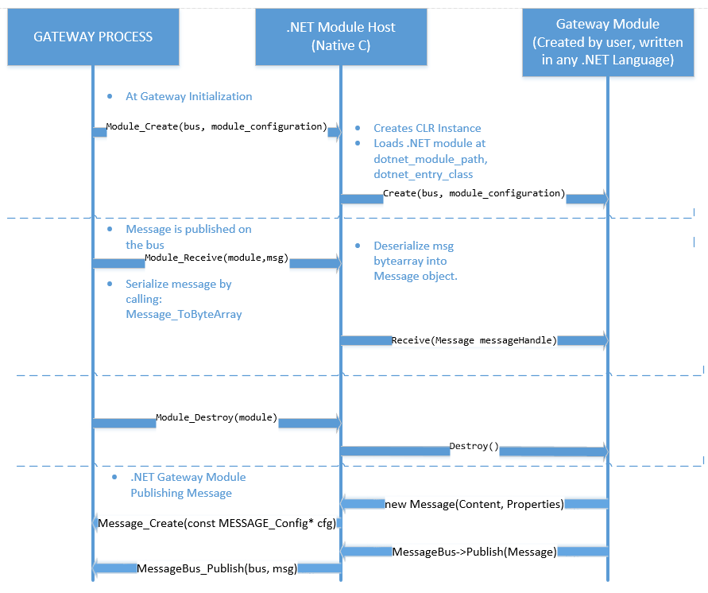

.NET Sample for Windows Desktop
===============================

Overview
--------

This sample showcase how one might build modules for IoT Gateway in .NET.

The sample contains:

1. A printer module (C#) that interprets telemetry from sensor and prints it's content and properties into Console.
2. A sensor module (C#) that publishes random data to the gateway.
3. A logger module for producing message bus diagnostics.

Other resources:
*[getting started doc](getting_started.md)
*[devbox setup](devbox_setup.md)
*[.NET binding High Level Design](../bindings/dotnet/devdoc/dotnet_bindings_hld.md)
*.Net Framework Installer: https://www.microsoft.com/en-us/download/details.aspx?id=17851

Prerequisites
--------------
1. Have your devbox setup (windows) [devbox setup](devbox_setup.md).
2. Make sure you have .NET Framework installed. Our current version of the binding was tested and loads modules written in .NET version v4.0.30319.

How does the data flow through the Gateway
------------------------------------------
You can find the diagram for Receiving a message and publishing a message on this flow chart:




Building the sample
-------------------
At this point, gateways containing .NET modules are only supported on Windows Desktop. The sample Gateway gets built when you build the SDK by running `tools/build.cmd`.  The
[devbox setup](devbox_setup.md) guide has information on how you can build the SDK.
To build .NET Modules you should build solution here (../bindings/dotnet/dotnet-binding/dotnet-binding.sln).
Today the Solution has: 
1. Microsoft.Azure.IoT.Gateway ==> DLL you shall reference on your module project.
2. Microsoft.Azure.IoT.Gateway.Test ==> Unit tests for the implementation of Message and MessageBus Classes.
3. PrinterModule ==> .NET(C#) Module that output to the console content received by Sensor Module.
4. Sensor Module ==> .NET(C#) Module that publishes Simulated Sensor data to the gateway.

Building the solution you will have the following binaries: 
1. Microsoft.Azure.IoT.Gateway.Test.dll.
2. SensorModule.dll.
3. PrinterModule.dll.

Copy these binaries to the same folder you run your gateway. 

Running the sample
------------------
1. Open azure_iot_gateway_sdk solution and configure project `dotnet_binding_sample` as a Startup Sample.
2. Go to the Project Properties and change `Command Arguments` to point to dotnet_binding_sample.json.
3. Copy the following binaries to the folder: `build\samples\dotnet_binding_sample\Debug`:
    * Microsoft.Azure.IoT.Gateway.dll(and pdb if you want to debug).
    * PrinterModule.dll.
    * SensorModule.dll.
4. Change the configuration Debugger Type to Mixed (this way you will be able to set breakpoints on Managed code as well as Native Code).
5. Run.


Json Configuration
------------------
```json
{
    "modules" :
    [
        {
            "module name" : "logger_hl",
            "module path" : "..\\..\\..\\modules\\logger\\Debug\\logger_hl.dll",
            "args" : {"filename":"C:\\Temp\\Log.txt"} 
        },
        {
          "module name": "dotnet_sensor_module",
          "module path": "..\\..\\..\\bindings\\dotnet\\Debug\\dotnet_hl.dll",
          "args": {
            "dotnet_module_path": "SensorModule",
            "dotnet_module_entry_class": "SensorModule.DotNetSensorModule",
            "dotnet_module_args": "module configuration"
          }
        },
        {
            "module name" : "dotnet_printer_module",
            "module path" : "..\\..\\..\\bindings\\dotnet\\Debug\\dotnet_hl.dll",
            "args" : {
                "dotnet_module_path": "PrinterModule",
                "dotnet_module_entry_class": "PrinterModule.DotNetPrinterModule",
                "dotnet_module_args": "module configuration"
            }
        }

    ]
}
```

Creating your own module
------------------------
1. Create a .NET project (DLL) (Class library).
2. Add Reference to Microsoft.Azure.IoT.Gateway DLL.
3. On your class you shall implement `IGatewayModule`.
   See the Printer module as example:
~~~~~~~~~~~~~~~~~~~~~~~~~~~~~~~~~~~~~~~~~~~~~~~~~~~~~~~~~~~~~~~~~~~~~~~~~~ C#
using System;
using System.Collections.Generic;
using System.Linq;
using System.Text;
using System.Threading.Tasks;
using Microsoft.Azure.IoT.Gateway;


namespace PrinterModule
{
    private MessageBus busToPublish;
    private string configuration;

    public class DotNetPrinterModule : IGatewayModule
    {
        private MessageBus busToPublish;
        private string configuration;
        public void Create(MessageBus bus, string configuration)
        {
            this.busToPublish = bus;
            this.configuration = configuration;
        }

        public void Destroy()
        {
            Console.WriteLine("This is C# Sensor Module Destroy!");
        }

        public void Receive(Message received_message)
        {
            if(received_message.Properties["source"] == "sensor")
            {
                Console.WriteLine("Printer Module received message from Sensor. Content: " + System.Text.Encoding.UTF8.GetString(received_message.Content, 0, received_message.Content.Length));
            }
        }
    }
}
~~~~~~~~~~~~~~~~~~~~~~~~~~~~~~~~~~~~~~~~~~~~~~~~~~~~~~~~~~~~~~~~~~~~~~~~~~

4. Add your new module on Json configuration:
```json
{
    "modules" :
    [
        {
            "module name" : "dotnet_printer_module", ==> Your new module name. 
            "module path" : "..\\..\\..\\bindings\\dotnet\\Debug\\dotnet_hl.dll", ==> This is the location where the dotnet_hl.dll is located.
            "args" : {
                "dotnet_module_path": "PrinterModule", ==> This is the name of your module dll. On this sample it is PrinterModule.dll
                "dotnet_module_entry_class": "PrinterModule.DotNetPrinterModule", ==> This is the name of your Class (Namespace.ClassName) that implements IGatewayModule.
                "dotnet_module_args": "module configuration" ==> This is any configuratio you want to use on your sample. It will be passed to you as a String, you can add a JSON configuration in it.
            }
        }

    ]
}
```