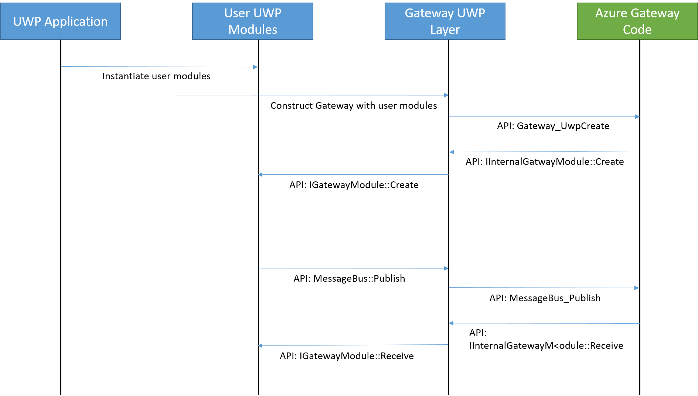

UWP Sample
===============================

Overview
--------

This sample showcases how one might build modules for IoT Gateway for UWP.  It domonstrates 3 types of gateways: a UWP C++ App, a 
UWP C++ Background Application, and a UWP C# Background application.  Each of these gateways can utilize the UWP Sensor and Printer 
modules.

Other resources:
* [getting started doc](getting_started.md)
* [devbox setup](devbox_setup.md)
* [UWP binding High Level Design](../bindings/uwp/devdoc/uwp_hld.md)

Prerequisites
--------------
1. Have your devbox setup (windows) [devbox setup](devbox_setup.md).
2. Make sure you have Visual Studio Tools for Universal Windows Apps installed.

How does the data flow through the Gateway
------------------------------------------
You can find the diagram for Receiving a message and publishing a message on this flow chart:




Building the sample
-------------------
At this point, creating a UWP gateway containing UWP modules is supported on all UWP platforms (Windows Desktop, 
Windows Phone, Windows 10 IoT Core). 

To build the UWP Sample Gateway and UWP Modules open the solution here: `../samples/uwp/UwpSample.sln`.  You can
build the solution by selecting **Build > Build Solution**.

Today the sample contains these projects: 

1. Microsoft.Azure.IoT.Gateway ==> UWP DLL containing the required Gateway and Module components.
2. IotCoreGatewayCppUwp ==> UWP(C++) App (can be run on all UWP platforms) gateway project.
3. IotCoreGatewayCpp ==> UWP(C++) Background Application (most useful on Windows 10 Iot Core) gateway project.
4. IotCoreGatewayCs ==> UWP(C#) Background Application (most useful on Windows 10 Iot Core) gateway project
5. SetOfCppModules ==> UWP(C++) DLL containing Sensor and Printer modules.
6. SetOfCsModules ==> UWP(C#) DLL containing Sensor and Printer modules.

Building the solution will create the following binaries: 

1. Microsoft.Azure.IoT.Gateway.dll.
2. IotCoreGatewayCppUwp.exe.
3. IotCoreGatewayCpp.dll.
4. IotCoreGatewayCs.dll.
5. SetOfCppModules.dll.
6. SetOfCsModules.winmd.

To deploy these binaries and run your gateway, you can use Visual Studio's F5 (also invoked by selecting **Debug > Start Debugging**).  

Alternatively, these files can be packaged in an APPX file (this file can be uploaded to the Microsoft Store 
or App side-loading).  You can find information on creating an APPX file [here](https://msdn.microsoft.com/en-us/library/hh454036.aspx).

Running the sample
------------------
1. Open UwpSample.slb solution and configure project `IotCoreGatewayCppUwp` as a Startup Sample.
2. Go to the Project Properties and change `Debugging` to point at Local Machine.
3. Change the configuration Debugger Type to Mixed (this way you will be able to set breakpoints on Managed code as well as Native Code).
4. Run.

Creating your own module
------------------------

1. Create a Windows Runtime Component (DLL) project.
2. Add Reference to Microsoft.Azure.IoT.Gateway DLL.
3. On your class you shall implement `IGatewayModule`.

    ```
    using System;
    using System.Collections.Generic;
    using Microsoft.Azure.IoT.Gateway;
    
    namespace MyNewModule
    {
        public sealed class Module : IGatewayModule
        {
            public void Create(MessageBus bus, IReadOnlyDictionary<string, string> configuration)
            {
                System.Diagnostics.Debug.WriteLine("MyNewModule.Module.Create");
            }
    
            public void Destroy()
            {
                System.Diagnostics.Debug.WriteLine("MyNewModule.Module.Destroy");
            }
    
            public void Receive(Message received_message)
            {
                System.Diagnostics.Debug.WriteLine("MyNewModule.Module.Receive");
            }
        }
    }
    ```
4. Add a reference to your new module to IotCoreGatewayCppUwp and add a module instantiation to the module list in MainPage.xaml.cpp:

    ```C#
        modules->Append(ref new MyNewModule::Module());
    ```
