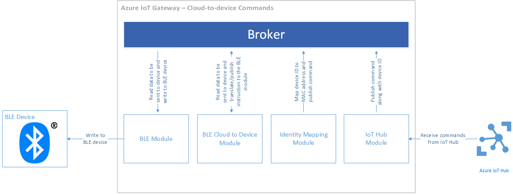

Bluetooth Low Energy Telemetry Sample for Azure IoT Gateway SDK
===============================================================

Overview
--------

This sample showcases how one can build an IoT Gateway that interacts with a 
Bluetooth Low Energy (BLE) device using the Azure IoT Gateway SDK. A more in
depth [walkthrough](https://docs.microsoft.com/en-us/azure/iot-hub/iot-hub-gateway-sdk-physical-device) 
with concept explanations and code snippets can be found on 
[docs.microsoft.com](https://docs.microsoft.com/en-us/azure/iot-hub/).

The sample contains the following modules:

  1. A Bluetooth Low Energy (BLE) module that interfaces with the BLE device to
     read temperature data.
  2. A logger module for producing message broker diagnostics.
  3. An identity mapping module for translating between BLE device MAC addresses
     and Azure IoT Hub device identities.
  4. An IoT Hub module for uploading BLE telemetry data and for receiving
     device commands from the Azure IoT Hub.
  5. A BLE Printer module that interprets telemetry from the Texas Instruments
     SensorTag device and prints formatted data to the console.

How does the data flow through the Gateway
------------------------------------------

The telemetry upload data flow pipeline is best described via a block diagram:


Here's the journey that a piece of telemetry data takes originating from a BLE
device before finding its way to an Azure IoT Hub.

  1. The BLE device generates a temperature sample and transfers it over
     Bluetooth to the BLE module.
  2. The BLE Module receives the sample and publishes it to the message broker
     along with the device's MAC address.
  3. The identity mapping module picks up this message from the message broker
     and looks up its internal table in order to translate the device MAC address 
     into an Azure IoT Hub identity (comprised of a device ID and device key). 
     It then proceeds to publish a new message on to the message broker containing 
     the temperature sample data, the MAC address, the IoT Hub device ID and
     key.
  4. The IotHub module then receives this message from the identity
     mapping module and publishes it to the Azure IoT Hub itself.
  5. The logger module logs all messages from the message broker into a file on
     the disk.

The cloud to device command data flow pipeline is described via a block diagram
below:



  1. The IotHub module periodically polls Azure IoT Hub for new command
     messages that might be available.
  2. When the IotHub module receives a new command message, it publishes
     it to the message broker.
  3. The Identity Mapping module picks up the message and translates the Azure
     IoT Hub device ID to a device MAC address and publishes a new message to
     the message broker including the MAC address in the message's properties map.
  4. The BLE module then picks up this message and executes the I/O instruction
     by communicating with the BLE device.

Building the sample
-------------------

At this point, gateways containing BLE modules are only supported on Linux. The
sample gets built when you build the SDK by running `tools/build.sh`.  The
[devbox setup](../../doc/devbox_setup.md) guide has information on how you can build the
SDK.

Preparing your BLE device
-------------------------

This sample has been tested with the [Texas Instruments SensorTag](http://www.ti.com/ww/en/wireless_connectivity/sensortag2015/index.html)
device on a Raspberry Pi 3. Before running the sample you'll want to
prepare the device by following the instructions in the article that talks about
[connecting a BLE device on the Raspberry Pi 3](./connecting_to_ble_device_on_rpi3.md).
Though the article talks about Raspberry Pi 3 in specific, it should be possible
to adapt the instructions to any arbitrary device that supports BLE and
runs Linux.

Running the sample
------------------

In order to bootstrap and run the sample, you'll need to configure each module
that participates in the gateway. This configuration is provided as a JSON file,
which must be encoded either as ASCII or UTF-8. All 5 participating modules will need
to be configured. There is a sample JSON file provided in the repo called
`gateway_sample.json` which you can use as a starting point for building your
own configuration file. You should find the file at the path
`samples/ble_gateway/src` relative to the root of the repo.

In order to run the sample you'll run the `ble_gateway` binary passing the
path to the configuration JSON file. The following command assumes that you are
running the the executable from the root of the repo.

```
./build/samples/ble_gateway/ble_gateway ./samples/ble_gateway/src/gateway_sample.json
```

Template configuration JSONs are given below for all the modules that are a part
of this sample. The sample configuration for the BLE device assumes a Texas
Instruments SensorTag device. But any standard BLE device that can operate as a
GATT peripheral should work. You'll only need to update the GATT characterstic
IDs and data (for write instructions). 

### Logger configuration

```json
{
  "name": "Logger",
  "loader": {
    "name" : "native",
    "entrypoint" : {
      "module.path" : "build/modules/logger/liblogger.so"
    }
  },
  "args":
  {
    "filename": "<</path/to/log-file.log>>"
  }
}
```

### BLE module configuration

```json
{
  "name": "SensorTag",
  "loader": {
    "name" : "native",
    "entrypoint" : {
      "module.path": "build/modules/ble/libble.so"
    }
  },
  "args": {
    "controller_index": 0,
    "device_mac_address": "<<AA:BB:CC:DD:EE:FF>>",
    "instructions": [
      {
        "type": "read_once",
        "characteristic_uuid": "00002A24-0000-1000-8000-00805F9B34FB"
      },
      {
        "type": "read_once",
        "characteristic_uuid": "00002A25-0000-1000-8000-00805F9B34FB"
      },
      {
        "type": "read_once",
        "characteristic_uuid": "00002A26-0000-1000-8000-00805F9B34FB"
      },
      {
        "type": "read_once",
        "characteristic_uuid": "00002A27-0000-1000-8000-00805F9B34FB"
      },
      {
        "type": "read_once",
        "characteristic_uuid": "00002A28-0000-1000-8000-00805F9B34FB"
      },
      {
        "type": "read_once",
        "characteristic_uuid": "00002A29-0000-1000-8000-00805F9B34FB"
      },
      {
        "type": "write_at_init",
        "characteristic_uuid": "F000AA02-0451-4000-B000-000000000000",
        "data": "AQ=="
      },
      {
        "type": "read_periodic",
        "characteristic_uuid": "F000AA01-0451-4000-B000-000000000000",
        "interval_in_ms": 1000
      },
      {
        "type": "write_at_exit",
        "characteristic_uuid": "F000AA02-0451-4000-B000-000000000000",
        "data": "AA=="
      }
    ]
  }
}
```

### IotHub module

```json
{
  "name": "IoTHub",
  "loader": {
    "name" : "native",
    "entrypoint" : {
      "module.path": "build/modules/iothub/libiothub.so"
    }
  },
  "args": {
    "IoTHubName": "<<Azure IoT Hub Name>>",
    "IoTHubSuffix": "<<Azure IoT Hub Suffix>>",
    "Transport" : "amqp"
  }
}
```

### Identity mapping module configuration

```json
{
  "name": "mapping",
  "loader": {
    "name" : "native",
    "entrypoint" : {
      "module.path": "build/modules/identitymap/libidentity_map.so"
    }
  },
  "args": [
    {
      "macAddress": "AA:BB:CC:DD:EE:FF",
      "deviceId": "<<Azure IoT Hub Device ID>>",
      "deviceKey": "<<Azure IoT Hub Device Key>>"
    }
  ]
}
```

### BLE Printer module configuration

```json
{
  "name": "BLE Printer",
  "loader": {
    "name" : "native",
    "entrypoint" : {
      "module.path": "build/samples/ble_gateway/ble_printer/libble_printer.so"
    }
  },
  "args": null
}
```

### BLEC2D module configuration

```json
{
  "name": "BLEC2D",
  "loader": {
    "name" : "native",
    "entrypoint" : {
      "module.path": "build/modules/ble/libble_c2d.so"
    }
  },
  "args": null
}
```

Sending cloud-to-device messages
--------------------------------

The BLE module also supports sending of instructions from the Azure IoT Hub to
the device. You should be able to use the
[Azure IoT Hub Device Explorer](https://github.com/Azure/azure-iot-sdks/blob/master/tools/DeviceExplorer/doc/how_to_use_device_explorer.md) or the [IoT Hub Explorer](https://github.com/Azure/azure-iot-sdks/tree/master/tools/iothub-explorer)
to craft and send JSON messages that are handled and passed on to the BLE device
by the BLE module. If you are using the Texas Instruments SensorTag device then you 
can turn on the red LED, green LED, or buzzer by sending commands from IoT Hub. To 
do this, first send the following two JSON messages in order. Then you can send any 
of the commands to turn on the lights or buzzer.

1. Reset all LEDs and the buzzer (turn them off)
  
    ```json
    {
      "type": "write_once",
      "characteristic_uuid": "F000AA65-0451-4000-B000-000000000000",
      "data": "AA=="
    }
    ```

2. Configure I/O as 'remote'

    ```json
    {
      "type": "write_once",
      "characteristic_uuid": "F000AA66-0451-4000-B000-000000000000",
      "data": "AQ=="
    }
    ```

   - Turn on red LED

    ```json
    {
      "type": "write_once",
      "characteristic_uuid": "F000AA65-0451-4000-B000-000000000000",
      "data": "AQ=="
    }
    ```

    - Turn on green LED
    ```json
    {
      "type": "write_once",
      "characteristic_uuid": "F000AA65-0451-4000-B000-000000000000",
      "data": "Ag=="
    }
    ```

    - Turn on the buzzer
    ```json
    {
      "type": "write_once",
      "characteristic_uuid": "F000AA65-0451-4000-B000-000000000000",
      "data": "BA=="
    }
    ```