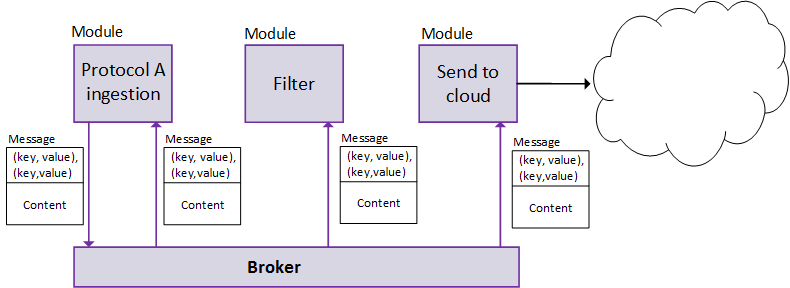
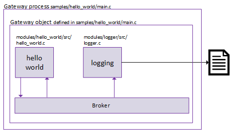

#Azure IoT Gateway SDK - Hello World

This document provides a detailed overview of the Hello World sample [code](./src) which uses the fundamental components of the Azure IoT Gateway SDK architecture to log a hello world message to a file every 5 seconds.

#The walkthrough covers

1.  **Dev box setup** - steps necessary to build and run the sample
2.  **Concepts** - conceptual overview of the components that compose any gateway created with the SDK  
3.  **Hello World sample architecture** - describes how the concepts apply to the sample and how the components fit together
4.  **Detailed architecture** - detailed view of the Hello World sample's architecture
5.  **How to build the sample**
6.  **How to run the sample** 
7.  **Typical output** - example of typical output when the hello world sample is run on Linux or Windows
8.  **Code snippets** - code snippets which show how and where the Hello World sample implements key gateway components 

##Dev box setup 

A dev box configured with the SDK and necessary libraries is necessary to complete this walkthrough. Please complete the [dev box setup](../../doc/devbox_setup.md) before continuing.

##Concepts

###Modules

Modules are the brains of a gateway built with the Azure IoT Gateway SDK. Modules exchange data with each other via messages. A module receives a message, performs some action on it, might transform it into a new message, and subsequently publishes it to other modules. There might be modules that only produce new messages and never process incoming messages. A chain of modules can be thought of as a data processing pipeline with a module being nothing more than a chunk of code performing a transformation on the data at one point in that pipeline.

 
 
The SDK contains the following:

- prewritten modules which perform common gateway functions
- the interfaces needed for a developer to write his own custom modules
- the infrastructure necessary to deploy and run a set of modules

The SDK abstracts away  operating system dependencies via an abstraction layer in order to allow for gateways to be built on a variety of platforms.

 

###Messages

Thinking about modules passing each other messages is a convenient way of conceptualizing how a gateway functions, but it does not accurately reflect what's happening under the hood. Modules actually use a broker to communicate with each other. They publish messages to the broker (bus, pubsub or any other messaging pattern) and then let the broker route the message to the modules connected to it.

A module publishes a message to the broker via the `Broker_Publish` function. The broker delivers messages to a module by invoking a callback on the module and passing that function the message that is being delivered. A message consists of a set of key/value properties and content passed as a block of memory.



###Message routing and filtering

Today we have 2 ways of directing the message to the correct modules. First is by passing a set of links to the broker, so the broker knows the source and sink for each module. Second is by the module filtering its properties. A module should only act upon a message if the message is intended for it. The links and this message filtering is what effectively creates a message pipeline.

This is enough background to actually start discussing the Hello World sample.

##Hello World sample architecture

Before diving into the details of filtering messages based on properties or links, first think of the Hello World sample simply in terms of modules. The sample is made up of a pipeline of two modules:
-  A "hello world" module
-  A logger module

The "hello world" module creates a message every 5 seconds and passes it to the logger module. The logger module simply writes the message to a file. 

 

##Detailed architecture

Based on the gateway architecture, we know that the "hello world" module is not directly passing messages to the logger module every 5 seconds. Instead, it is actually publishing a message to the broker every 5 seconds.

The logger module is then receiving the message from the broker and acting upon it, writing the contents of the message to a file.

The logger module only consumes messages (by logger them to a file) and never publishes new messages to the broker.
 
 
 
The figure above shows an accurate representation of the Hello World sample's architecture as well as the relative paths to the source files that implement different portions of the sample. Feel free to explore the code on your own, or use the code snippets below as a guide.

##How to build the sample
Linux

1. Open a shell
2. Navigate to `azure-iot-gateway-sdk/tools/`
3. Run `./build.sh`

>Note: `build.sh` does multiple things. It builds the project and places it in the "build" folder in the root of the repo. This folder is deleted and recreated every time `build.sh` is run. Additionally, `build.sh` runs all tests. The project can be build manually by using cmake. To do this:

>create a folder for the build output and navigate to that folder.

>run `sudo cmake <path to repo root>`

>Note: The cmake scripts will check for installed cmake dependencies on your machine before it attempts to fetch, build, and install them for you.

>run `make -j $(nproc)`

>To run the tests:

>run `ctest -j $(nproc) -C Debug --output-on-failure`

Windows

1. Open a Developer Command Prompt for VS2015 as an Administrator
2. Navigate to `azure-iot-gateway-sdk\tools\`
3. Run `build.cmd`. 

>Note: `build.cmd` does multiple things. It builds a solution ('azure_iot_gateway_sdk.sln') and places it in the "build" folder in the root of the repo. This folder is deleted and recreated every time `build.cmd` is run. Additionally, `build.cmd` runs all tests. The project can be build manually by using cmake. To do this:

>create a folder for the build output and navigate to that folder.

>run `cmake <path to repo root>`

>Note: The cmake scripts will check for installed cmake dependencies on your machine before it attempts to fetch, build, and install them for you.

>run `msbuild /m /p:Configuration="Debug" /p:Platform="Win32" azure_iot_gateway_sdk.sln`

>To run the tests:

>run `ctest -C Debug -V`

##How to run the sample

Linux

- build.sh produces its outputs in `azure-iot-gateway-sdk/build`. This is where the two module SOs and executable used in this sample are built.
> Note: The logger module is built as `/modules/logger/logger.so`. The hello world module is built as `/modules/hello_world/hello_world.so`. The sample executable is built as `/samples/hello_world/hello_world_sample`. 

- The hello_world_sample process takes the path to a JSON configuration file as an argument in the command line. The file must be encoded either as ASCII or UTF-8. An example JSON file has been provided as part of the repo at `azure-iot-gateway-sdk/samples/hello_world/src/hello_world_win.json' and is copied below. It will work as is unless you have modified the build script to place modules or sample executables in non-default locations.
> Note: The module paths are relative to the current working directory from where the hello_world_sample executable is launched, not the directory where the executable is located. The sample JSON configuration file is defaults to writing 'log.txt' in your current working directory.

```json
{
    "modules" :
    [
        {
          "name" : "logger",
          "loader": {
            "name": "native",
            "entrypoint": {
              "module.path": "./modules/logger/liblogger.so"
            }
          },
          "args" : {"filename":"log.txt"}
        },
        {
            "name" : "hello_world",
          "loader": {
            "name": "native",
            "entrypoint": {
              "module.path": "./modules/hello_world/libhello_world.so"
            }
          },
            "args" : null
        }
    ],
    "links": 
    [
        {
            "source": "hello_world",
            "sink": "logger"
        }
    ]
}
```

- Navigate to `azure-iot-gateway-sdk/`.

-  Run `$ ./build/samples/hello_world/hello_world_sample samples/hello_world/src/hello_world_lin.json`


Windows

- `build.cmd` produces a folder called `build` in the root repo folder. This is where the two module dlls and executable used in this sample are built.
> Note: The logger module is built as `\modules\logger\Debug\logger.dll`. The hello world module is built as `\modules\hello_world\Debug\hello_world.dll`. The sample exe is built as `\samples\hello_world\Debug\hello_world_sample.exe`.

- The hello_world_sample process takes the path to a JSON configuration file as an argument in the command line. The file must be encoded either as ASCII or UTF-8. An example JSON file has been provided as part of the repo at `azure-iot-gateway-sdk\samples\hello_world\src\hello_world_win.json' and is copied below. It will work as is unless you have modified the build script to place modules or sample executables in non-default locations.
> Note: The module paths are relative to the directory where the hello_world_sample.exe is located. The sample JSON configuration file is defaults to writing 'log.txt' in your current working directory.

```json
{
  "modules": [
    {
      "name": "logger",
      "loader": {
        "name": "native",
        "entrypoint": {
          "module.path": "..\\..\\..\\modules\\logger\\Debug\\logger.dll"
        }
      },
      "args": { "filename": "log.txt" }
    },
    {
      "name": "hello_world",
      "loader": {
        "name": "native",
        "entrypoint": {
          "module.path": "..\\..\\..\\modules\\hello_world\\Debug\\hello_world.dll"
        }
      },
      "args": null
      }
  ],
  "links": [
    {
      "source": "hello_world",
      "sink": "logger"
    }
  ]
}
```

- Navigate to `azure-iot-gateway-sdk\`.

- Run `.\build\samples\hello_world\Debug\hello_world_sample.exe samples\hello_world\src\hello_world_win.json`


## Typical Output
Below is an example of typical output that is written to the log file when the Hello World sample is run on Linux or Windows. The output below has been formatted for readability purposes.

```json
[{
    "time": "Mon Apr 11 13:48:07 2016",
    "content": "Log started"
}, {
    "time": "Mon Apr 11 13:48:48 2016",
    "properties": {
        "helloWorld": "from Azure IoT Gateway SDK simple sample!"
    },
    "content": "aGVsbG8gd29ybGQ="
}, {
    "time": "Mon Apr 11 13:48:55 2016",
    "properties": {
        "helloWorld": "from Azure IoT Gateway SDK simple sample!"
    },
    "content": "aGVsbG8gd29ybGQ="
}, {
    "time": "Mon Apr 11 13:49:01 2016",
    "properties": {
        "helloWorld": "from Azure IoT Gateway SDK simple sample!"
    },
    "content": "aGVsbG8gd29ybGQ="
}, {
    "time": "Mon Apr 11 13:49:04 2016",
    "content": "Log stopped"
}]
```

##Code snippets

###Gateway creation

The gateway process needs to be written by the developer. This a program which creates internal infrastructure (e.g. the broker), loads the correct modules, and sets everything up to function correctly. The SDK provides the `Gateway_CreateFromJson` function which allows developers to bootstrap a gateway from a JSON file.

`Gateway_CreateFromJson` deals with creating internal infrastructure (e.g. the broker), loading modules, and setting everything up to function correctly. All the developer needs to do is provide this function with the path to a JSON file specifying what modules they want loaded and links to guide the broker to send messages to the correct module. The configuration file must be encoded either as ASCII or UTF-8.

The code for the Hello World sample's gateway process is contained in [`samples/hello_world/main.c`](./src/main.c) A slightly abbreviated version of that code is copied below. This very short program just creates a gateway and then waits for the ENTER key to be pressed before it tears down the gateway. 

```c
int main(int argc, char** argv)
{
    GATEWAY_HANDLE gateway;
    if ((gateway = Gateway_CreateFromJson(argv[1])) == NULL)
    {
        printf("failed to create the gateway from JSON\n");
    }
    else
    {
        printf("gateway successfully created from JSON\n");
        printf("gateway shall run until ENTER is pressed\n");
        (void)getchar();
        Gateway_Destroy(gateway);
    }
    return 0;
}
```
 
The JSON settings file contains a list of modules to load and links between the modules.
Each module must specify a:

* **name**: a unique name for the module.
* **loader**: a loader which knows how to load the desired module.  Loaders are an extension 
point for loading different types of modules. We provide loaders for use with modules written 
in native C, Node.js, Java, and .Net. The Hello World sample only uses the "native" loader since 
all the modules in this sample are dynamic libraries written in C. Please refer to the [Node](https://github.com/Azure/azure-iot-gateway-sdk/blob/master/samples/nodejs_simple_sample/), 
[Java](https://github.com/Azure/azure-iot-gateway-sdk/tree/master/samples/java_sample), or [.Net](https://github.com/Azure/azure-iot-gateway-sdk/tree/master/samples/dotnet_binding_sample) 
samples for more information on using modules written in different languages.
    * **name**: name of the loader used to load the module.  
    * **entrypoint**: the path to the library containing the module. For Linux this is a .so 
    file, on Windows this is a .dll file. Note that this entrypoint is specific to the type of 
    loader being used. For example, the Node.js loader's entrypoint is a .js file, the Java 
    loader's entery point is a classpath + class name, and the .Net loader's entry point is an 
    assembly name + class name.

* **args**: any configuration information the module needs.

The following code shows the JSON used to declare all of the modules for the Hello World 
sample on Linux. Whether a module requires any arguments depends on the design of the module. 
In this example, the logger module takes an argument which is the path to the output file 
and the Hello World module does not take any arguments.

```
"modules" :
[
    {
        "name" : "logger",
        "loader": {
          "name": "native",
          "entrypoint": {
            "module.path": "./modules/logger/liblogger.so"
        }
        },
        "args" : {"filename":"log.txt"}
    },
    {
        "name" : "hello_world",
        "loader": {
          "name": "native",
          "entrypoint": {
            "module.path": "./modules/hello_world/libhello_world.so"
        }
        },
        "args" : null
    }
]
```

The JSON file also contains the links between the modules that will be passed to the broker. 
A link has two properties:

* **source**: a module name from the `modules` section, or "\*".
* **sink**: a module name from the `modules` section.

Each link defines a message route and direction. Messages from module `source` are to be delivered 
to the module `sink`. The `source` may be set to "\*", indicating that messages from any module 
will be received by `sink`.

The following code shows the JSON used to configure links between the modules used in the Hello 
World sample on Linux. Every message produced by module `hello_world` will be consumed by module 
`logger`.

```
"links": 
[
    {
        "source": "hello_world",
        "sink": "logger"
    }
]
```

###"hello world" module message publishing

The code used by the "hello world" module to publish messages is in [`hello_world.c`](../../modules/hello_world/src/hello_world.c). An amended version has been reproduced below. Comments calling out the more interesting parts of message creation and publishing process has been given below. 
Also, error checks have been omitted for the sake of brevity.

```c
int helloWorldThread(void *param)
{
    // create data structures used in function.
    HELLOWORLD_HANDLE_DATA* handleData = param;
    MESSAGE_CONFIG msgConfig;
    MAP_HANDLE propertiesMap = Map_Create(NULL);
    
    // add a property named "helloWorld" with a value of "from Azure IoT
    // Gateway SDK simple sample!" to a set of message properties that
    // will be appended to the message before publishing it. 
    Map_AddOrUpdate(propertiesMap, "helloWorld", "from Azure IoT Gateway SDK simple sample!")

    // set the content for the message
    msgConfig.size = strlen(HELLOWORLD_MESSAGE);
    msgConfig.source = HELLOWORLD_MESSAGE;

    // set the properties for the message
    msgConfig.sourceProperties = propertiesMap;
    
    // create a message based on the msgConfig structure
    MESSAGE_HANDLE helloWorldMessage = Message_Create(&msgConfig);

    while (1)
    {
        if (handleData->stopThread)
        {
            (void)Unlock(handleData->lockHandle);
            break; /*gets out of the thread*/
        }
        else
        {
            // publish the message to the broker
            (void)Broker_Publish(handleData->brokerHandle, helloWorldMessage);
            (void)Unlock(handleData->lockHandle);
        }

        (void)ThreadAPI_Sleep(5000); /*every 5 seconds*/
    }

    Message_Destroy(helloWorldMessage);

    return 0;
}
```

###"hello world" module message processing

The "hello world" module does not ever have to process any messages since it is not interested in any of the messages that are published. This makes implementation of the "hello world" module's message receive callback a no-op function.

```c
static void HelloWorld_Receive(MODULE_HANDLE moduleHandle, MESSAGE_HANDLE messageHandle)
{
    /*no action, HelloWorld is not interested in any messages*/
}
```

###Logger module message publishing

The logger module receives messages from the broker and writes them to a file. It never has to publish messages to the broker. Therefore, the code of the logger module never calls 'Broker_Publish'.

`Logger_Receive`, located in [`logger.c`](../../modules/logger/src/logger.c), is the logger module's callback invoked by the broker when it wants to deliver a message to the logger module. An amended version has been reproduced below. Comments call out parts of message processing have been provided. Again, error checks have been omitted for the sake of brevity.
```c
static void Logger_Receive(MODULE_HANDLE moduleHandle, MESSAGE_HANDLE messageHandle)
{

    time_t temp = time(NULL);
    struct tm* t = localtime(&temp);
    char timetemp[80] = { 0 };

    // get the message properties from the message
    CONSTMAP_HANDLE originalProperties = Message_GetProperties(messageHandle); 
    MAP_HANDLE propertiesAsMap = ConstMap_CloneWriteable(originalProperties);

    // convert the collection of properties into a JSON string
    STRING_HANDLE jsonProperties = Map_ToJSON(propertiesAsMap);

    //  base64 encode the message content
    const CONSTBUFFER * content = Message_GetContent(messageHandle);
    STRING_HANDLE contentAsJSON = Base64_Encode_Bytes(content->buffer, content->size);

    // start the construction of the final string to be logged by adding
    // the timestamp
    STRING_HANDLE jsonToBeAppended = STRING_construct(",{\"time\":\"");
    STRING_concat(jsonToBeAppended, timetemp);

    // add the message properties
    STRING_concat(jsonToBeAppended, "\",\"properties\":"); 
    STRING_concat_with_STRING(jsonToBeAppended, jsonProperties);

    // add the content
    STRING_concat(jsonToBeAppended, ",\"content\":\"");
    STRING_concat_with_STRING(jsonToBeAppended, contentAsJSON);
    STRING_concat(jsonToBeAppended, "\"}]");

    // write the formatted string
    LOGGER_HANDLE_DATA *handleData = (LOGGER_HANDLE_DATA *)moduleHandle;
    addJSONString(handleData->fout, STRING_c_str(jsonToBeAppended);
}
```
