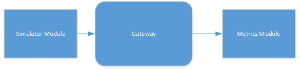

# Gateway Performance Measurement

Measure performance of the Gateway SDK.

## Overview

Sample goals:
- Ensure correctness under stress.
- Measure latency through gateway.
- Measure throughput over time.

There are two modules as part of this sample.  There is a simulator module 
producing messages and a metrics module consuming messages. The modules are 
coupled by the message contents and the gateway links. The following is a 
generic overview of the sample gateway:

 

## Metrics gathering

The metrics module assumes some information is present in the message properties 
in order to generate the desired metrics. The following table contains the 
expected message properties:

| Property           | Description    |
| ------------------ | -------------- |
| "deviceId"         | A device ID, assumed to be unique for each simulator module |
| "sequence number"  | The number of the message produced, increased by one for every new message published. |
| "timestamp"        | Time since clock epoch, in microseconds |

When the gateway shuts down, all metrics modules will log statistics for 
messages received.

The information the metrics module produces is:
- Test Duration in seconds. (Time from module start to module destroy.)
- Messages received.
- Average latency (in microseconds).
- Maximum latency (in mocroseconds).
- Number of non-conforming messages.
- Number of devices discovered.
- Per device statistics:
    - Messages received.
    - Number of out-of-sequence messages. 
    - Numer of messages lost.

### Note on latency calculations.

Messages will report time since clock epoch, and the epoch should be consistent 
between threads and processes on the same system.  If this assumption does not 
hold, then the latency measurements will not be accurate.

### Note on multiplicity.

The more simulator modules that are running in the gateway, the slower the 
metrics processing will take, as the metrics record information per device.

## Test Scenarios.

### Default test setup (basic test setup).

The default test setup is the most basic setup: A single simulator sending 
messages to a single metrics module. The simulator module has the message delay 
set to 0, so that the simulator will generate messages as quickly as possible, 
all other simulator settings are default.

 

The JSON file in the repository is set up for this test.

Objectives for this test:

- Non-conforming messages : 0
- Devices Discovered: 1
- Out-of-sequence messages: 0
- Messages Lost: 0

The remaining information is intended for reference and measurement.

### Other tests scenarios

Once baseline performance is measured on the target platforms for the basic 
test setup, the performance tests should be expanded to other tests.

#### Multiple simulators 

This scenario adds an additional simulator module to the basic test setup. The 
simulator has a different device name, and message delay set to 0.

Objectives for this test:

- Non-conforming messages : 0
- Devices Discovered: 2
- Out-of-sequence messages: 0
- Messages Lost: 0
- Message count between the two devices are roughly equal.


#### One simulator, multiple metrics

This scenario adds an additional metrics module to the basic test setup. The 
simulator is linked to both metrics modules.

Objectives for this test:

- Non-conforming messages : 0
- Devices Discovered: 1
- Out-of-sequence messages: 0
- Messages Lost: 0
- Metrics modules process roughly the same number of messages.

#### Out of process performance

This test would run the basic setup test with the modules out of process.
1. simulator out of process, metrics in process.
2. simulator in process, metrics out of process.
3. Both modules out of process.

Objectives for these tests:

- Non-conforming messages : 0
- Devices Discovered: 1
- Out-of-sequence messages: 0
- Messages Lost: 0

Performance on these measurements should be compared to the basic test setup 
- Messages received (message rate)
- Non-conforming messages
- Average latency
- Maximum latency

## Simulator module details

The Simulator Module produces messages with specified content at the specified 
rate. The messages will be produced once the module is started, and will be 
produced until the module is destroyed.


### Simulator JSON configuration

This module expects a JSON string in the format of a JSON object.  The following object fields are used:
<a name="SimulatorJsonConfigurationTable" ></a>

| Field              | Type                  | Default | Description    |
| ------------------ | --------------------- | ------- | -------------- |
| "deviceId"         | string                |         | Required field |
| "message.delay"    | unsigned int          | 0       | delay between messages in ms |
| "properties.count" | unsigned int          | 2       | number of additional properties to place in message |
| "properties.size"  | unsigned int          | 16      | size of additional properties |
| "message.size"     | unsigned int          | 256     | sizes of message content |

Example
```JSON
{
    "deviceId" : "simulated device 1",
    "message.delay" : 1,
    "properties.count" : 5,
    "properties.size" : 24,
    "message.size: : 100
}
```

### Exposed API

```c
typedef struct SIMULATOR_MODULE_CONFIG_TAG
{
    const char * device_id;
    unsigned int message_delay;
    unsigned int properties_count;
    unsigned int properties_size;
    unsigned int message_size;
} SIMULATOR_MODULE_CONFIG;


MODULE_EXPORT const MODULE_API* Module_GetApi(MODULE_API_VERSION gateway_api_version)
```

### Module\_GetApi
```c
MODULE_EXPORT const MODULE_API* Module_GetApi(MODULE_API_VERSION gateway_api_version)
```

`Module_GetApi` will assign all fields in the `MODULE_API_1` structure and return it.

### SimulatorModule\_ParseConfigurationFromJson
```c
void* SimulatorModule_ParseConfigurationFromJson(const char* configuration);
```

If `configuration` is `NULL` or is not a JSON string, then this function will 
return `NULL`. Otherwise, it will follow the [table describing the input paramters](#SimulatorJsonConfigurationTable) 
to determine how to handle the input parameters. Then it will allocate a 
`SIMULATOR_MODULE_CONFIG` structure, and return this on success.

### SimulatorModule\_FreeConfiguration
```c
void SimulatorModule_FreeConfiguration(void* configuration);
```

If `configuration` is not `NULL`, `SimulatorModule_FreeConfiguration` will 
release all resources allocated in `configuration`. 

### SimulatorModule\_Create
```c
MODULE_HANDLE SimulatorModule_Create(BROKER_HANDLE broker, const void* configuration);
```

`SimulatorModule_Create` will expect a non-`NULL` `broker` and `configuration`. 
If that check succeeds, then it will allocate memory for the module handle, 
copy all data from the `SIMULATOR_MODULE_CONFIG` structure, and create a block 
of pseudo random text for properties and content.

The pseudo random block of text will be sufficiently large enough to populate 
the largest property and the largest content. 


### SimulatorModule\_Start
```c
void SimulatorModule_Start(MODULE_HANDLE moduleHandle);
```

`SimulatorModule_Start` will start a thread to produce messages. 

### SimulatorModule_thread
```c
int SimulatorModule_thread(void * context);
```

`SimulatorModule_thread` will allocate a properties map with the properties in the following table: 

| Property           | Description    |
| ------------------ | -------------- |
| "deviceId"         | The assigned Device ID |
| "sequence number"  | The number of the message produced. |
| "timestamp"        | Time since clock epoch, in microseconds |
| "property count"   | The number of additional properties in this message |
| "property\<N\>"    | Where \<N\> is the number of the property, from 0 to "property count" - 1 |


Each additional property in the property map will be created with the size given when _Create was called and will be populated with text from the pseudo random block of text and null terminated. 

Then, `SimulatorModule_thread` will allocate a buffer for message content. The size of the message content will be the message size given when _Create was called, and the message content will be populated with text from the psuedo random block of text. 

Once the base message is created, it will loop until `SimulatorModule_Destroy` 
is called.

On each loop, `SimulatorModule_thread` will get the time at the start of the 
loop body (T1), increment the number of messages produced, assign the "sequence 
number" property in the property map to the number of messages produced, assign 
the "timestamp" property in the property map to the value of T1, contruct a 
message from the property map and the message content, and publish the new 
message. Next, `SimulatorModule_thread` will get the time after message is 
published (T2). If the time difference between T2 and T1 is less than the 
message delay, `SimulatorModule_thread` will sleep for the remaining time 
difference. 

If any step of the sequence fails, `SimulatorModule_thread` will 
log an error and return a negative value. Otherwise, `SimulatorModule_thread` 
will return the number of messages published.


### SimulatorModule\_Destroy
```c
void SimulatorModule_Destroy(MODULE_HANDLE moduleHandle);
```

`SimulatorModule_Destroy` will signal for the `SimulatorModule_thread` to end, 
and join with the `SimulatorModule_thread` and wait for it to terminate. Once 
it is complete, it will report the thread return value on stdout.

### SimulatorModule\_Receive
```c
void SimulatorModule_Receive(MODULE_HANDLE moduleHandle, MESSAGE_HANDLE messageHandle);
```

`SimulatorModule_Receive` will do nothing when called. 

## Metrics Module Details

The Metrics module will receive messages, track information about these messages and log this information when the module lifetime is complete. 

<a name="MetricsResultsTable" ></a>
The information the metrics module produces is:

| Metric                   | Measure             | Description |
| ------------------------ | ------------------- | ----------- |
| Test Duration            | Time (seconds)      | Time from module start to module destroy in seconds |
| Messages received        | Count               | Count of all messages received. |
| Non-conforming messages  | Count               | Number of message received that did not contain a timetamp, deviceId, or sequence number |
| Average latency          | Time (microseconds) | Average message latency |
| Maximum latency          | Time (microseconds) | Maximum message latency |
| Devices Discovered       | Count               | Number of deviceId names received in message. | 

The metrics module also produces this information for each deviceId recognized.

| Metric                   | Measure             | Description |
| ------------------------ | ------------------- | ----------- |
| Messages received        | Count               | Messages received for this device. |
| Out-of-sequence messages | Count               | The number of out of sequence messages. Receiving a message out of sequence means either a message was dropped or received in an incorrect order. |
| Messages Lost            | Count               | The number of messages lost. This is a count of gaps in the message sequence. |

### JSON configuration

This module does not have any configuration.

### Exposed API

```c
MODULE_EXPORT const MODULE_API* Module_GetApi(MODULE_API_VERSION gateway_api_version)
```

### Module\_GetApi

`Module_GetApi` will assign all fields in the `MODULE_API_1` structure and 
return it.


### MetricsModule\_ParseConfigurationFromJson
```c
void* MetricsModule_ParseConfigurationFromJson(const char* configuration);
```

`MetricsModule_ParseConfigurationFromJson` will return `NULL`. 

### MetricsModule\_FreeConfiguration
```c
void MetricsModule_FreeConfiguration(void* configuration);
```

 `MetricsModule_FreeConfiguration` will do nothing. 

### MetricsModule\_Create
```c
MODULE_HANDLE MetricsModule_Create(BROKER_HANDLE broker, const void* configuration);
```

If `broker` is `NULL` then this function will fail and return `NULL`. 
Otherwise, `MetricsModule_Create` will allocate memory for the module handle, 
and initialize all counters and measures.

### MetricsModule\_Start
```c
void MetricsModule_Start(MODULE_HANDLE moduleHandle);
```

`MetricsModule_Start` will do nothing if `moduleHandle` is `NULL`. Otherwise, 
`MetricsModule_Start` will record the time when this function is called as the 
start time. 

### MetricsModule\_Receive
```c
void MetricsModule_Receive(MODULE_HANDLE moduleHandle, MESSAGE_HANDLE messageHandle);
```

`MetricsModule_Receive` will do nothing if `moduleHandle` or `messageHandle` is 
`NULL`. Otherwise, `MetricsModule_Receive` will mark the time when the message 
is received. (referred to as T1), and increment the "message received" count.

`MetricsModule_Receive` will get the message properties, read the "timestamp" 
from the message properties, and determine the duration between T1 and the 
timestamp. This is the message latency. `MetricsModule_Receive` will measure 
the average and maximum latency.

`MetricsModule_Receive` will read the "deviceId" and "sequence number" from the 
message properties. `MetricsModule_Receive` will increment the "message 
received" count for the device. `MetricsModule_Receive` will increment the 
"out-of-sequence messages" if the expected sequence number does not match the 
message sequence number, and it will  increment the "messages lost" if the 
expected sequence is less than the message sequence number, the increment will 
be the difference between the sequence numbers. 

If any message property is not found, or cannot be converted into an integer, 
then `MetricsModule_Receive` will increment the "non-conforming messages" count 
and return.

### MetricsModule\_Destroy
```c
void MetricsModule_Destroy(MODULE_HANDLE moduleHandle);
```

If `moduleHandle` is `NULL` or if `MetricsModule_Start` was never called, then 
`MetricsModule_Destroy` will do nothing. Otherwise it will report the metrics 
in the [Metrics report table](#MetricsResultsTable). Then, it will release all 
resources allocated in `moduleHandle`.


## Running the performance test. 

To run on the command line, use the `performance_e2e` executable.

The program accepts 2 command line arguments, the json configuration file and an 
optional test duration in seconds. The sample creates the gateway from the JSON 
file, starts all modules, pauses for a given time (default of 5 seconds), and 
stops the gateway. Stopping the gateway will trigger the metrics module to 
report message statistics.

A 5 second and 10 second performance test are run as part of the build tests.
run `ctest -C Debug -V -R performance_e2e` to execute those tests.

