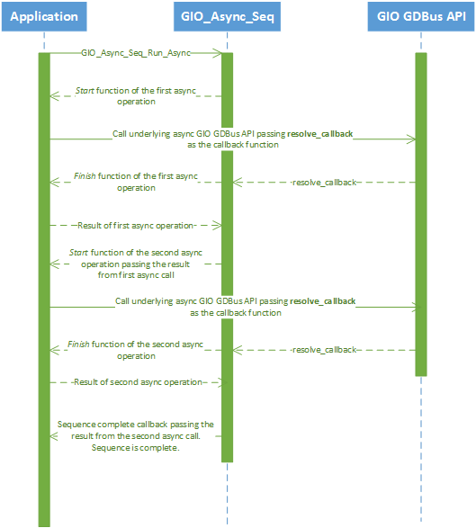

# GIO Asynchronous Sequence API

## Overview

The [GNOME GIO](https://developer.gnome.org/gio/2.46/) library provides APIs for dealing with various I/O operations in a given application. We use GIO's implementation of the [D-Bus](https://www.freedesktop.org/wiki/Software/dbus/) message bus system in order to communicate with the D-Bus objects that [BlueZ](http://www.bluez.org) - the *Bluetooth* stack implemenation on Linux - provides. Given that almost all D-Bus API calls are asynchronous, it proves to be useful to build an abstraction that allows us to succinctly express in code the intention that a set of asynchronous operations should be performed in sequence with support for early bail out in case one of the asynchronous operations produce an error. This document describes how this implementation works and helps navigate the implementation source of the API.

## What Does A Typical GIO Async API Call Look Like?

Let's take a look at an example of calling the GIO D-Bus API to acquire a reference to the system bus instance (as opposed to the session bus) asynchronously.

```c
typedef struct tagAPP_CONTEXT
{
    GDBusConnection* bus; // the connection to the system bus

    //------------------------------   
    // other application state here
    //------------------------------
    
}APP_CONTEXT;

int main()
{
    APP_CONTEXT context = { 0 };

    // open a connection to the system bus
    g_bus_get(
        G_BUS_TYPE_SYSTEM,  // we want the system bus
        NULL,               // this is not cancellable
        on_bus_connect,     // connect callback
        &context
    );

    // run the glib loop
    loop = g_main_loop_new(NULL, FALSE);
    g_main_loop_run(loop);

    return 0;
}
```

`g_bus_get` is a part of the D-Bus implementation in GIO. It asynchronously attempts to get a connection to a system/session bus (the system bus in this case) and provides a pointer to it via the callback supplied to it - in this case a function called `on_bus_connect`. Here's what `on_bus_connect` would look like:

```c
static void on_bus_connect(
    GObject* source_object,
    GAsyncResult* result,
    gpointer user_data
)
{
    APP_CONTEXT* context = (APP_CONTEXT*)user_data;
    GError* error = NULL;
    context->bus = g_bus_get_finish(result, &error);
    if (context->bus != NULL && error == NULL)
    {
        //------------------------------   
        // do something with the bus here
        //------------------------------
    }
    else
    {
        printf("Whoops! No bus for you. Error: %s\r\n", error->message);
        g_clear_error(&error);
    }
}
```

`g_bus_get_finish` is responsible for transforming the `GAsyncResult` pointer into a `GDBusConnection` pointer. Turns out that pretty much all asynchronous I/O APIs in GIO support this programming pattern, including, significantly, the requirement that all callbacks must necessarily match the signature as shown for the `on_bus_connect` function above. GIO defines a type called [`GAsyncReadyCallback`](https://developer.gnome.org/gio/stable/GAsyncResult.html#GAsyncReadyCallback) for this function signature like so:

```c
void
(*GAsyncReadyCallback) (GObject *source_object,
                        GAsyncResult *res,
                        gpointer user_data);
```

We take advantage of this to automate the task of running a set of asynchronous operations in sequence. 

## The GIO Async Sequence

### Creating The Sequence

A set of operations to be asynchronously run in sequence is represented using a `GIO_ASYNCSEQ_HANDLE` handle. One creates an instance of this like so:

```c
//
// this is some context information that will be made available
// from the GIO_ASYNCSEQ_HANDLE via the GIO_Async_Seq_GetContext API
//
MY_APP_CONTEXT* context = (MY_APP_CONTEXT*)malloc(sizeof(MY_APP_CONTEXT));

GIO_ASYNCSEQ_HANDLE async_seq = GIO_Async_Seq_Create(
    context,
    on_sequence_error,
    on_sequence_complete
);
```

Here, `on_sequence_error` and `on_sequence_complete` are callback functions that look like this:

```c
static void on_sequence_error(GIO_ASYNCSEQ_HANDLE async_seq_handle, const GError* error)
{
}

static void on_sequence_complete(GIO_ASYNCSEQ_HANDLE async_seq_handle, gpointer previous_result)
{
}
```

`on_sequence_error` is invoked when any of the asynchronous operations in the sequence fails. `on_sequence_complete` is called when all the asynchronous operations in the sequence run to completion successfully. The `context` parameter is a pointer that is cached by the sequence and is accessible at any point by calling `GIO_Async_Seq_GetContext`. One might use this pointer to store contextual data that is relevant to the async operations in the sequence.

### Adding Async Operations To The Sequence

Once the sequence handle has been instantiated, async operations can be added to the sequence via the `GIO_Async_Seq_Add` API. But what exactly is an *asynchronous operation*?

#### The (start, finish) Function Pair

If you look at the code snippet in the GIO async API example above, you'll note that we have a pair of functions being called - one to kick off the async operation and another one to *complete* the async call and fetch the results. In the code above `g_bus_get` gets the async call started and `g_bus_get_finish` is invoked to fetch the result of the call. In case an error occurs then `g_bus_get_finish` populates the `GError*` pointer with a valid error object.

In the GIO Async Sequence API we consider this pair of functions as defining a single async operation, i.e., users of this API will need to provide two functions for every async operation - a *start* function and a *finish* function. The start and the finish functions should match the function signatures as shown below:

```c
/**
 * The 'start' function.
 */
typedef void (*GIO_ASYNCSEQ_CALLBACK)(
    GIO_ASYNCSEQ_HANDLE async_seq_handle,
    gpointer previous_result,
    gpointer callback_context,
    GAsyncReadyCallback async_callback
);

/**
 * The 'finish' function.
 */
typedef gpointer (*GIO_ASYNCSEQ_FINISH_CALLBACK)(
    GIO_ASYNCSEQ_HANDLE async_seq_handle,
    GAsyncResult* result,
    GError** error
);
```

For example, taking the same example of acquiring a reference to the system bus, here's how you would write it when using the sequencer API:

<pre>
static void connect_system_bus(
    GIO_ASYNCSEQ_HANDLE async_seq_handle,
    gpointer previous_result,
    gpointer callback_context,
    GAsyncReadyCallback async_callback
)
{
    g_bus_get(
        G_BUS_TYPE_SYSTEM,
        NULL,
        <b>async_callback</b>,
        <b>async_seq_handle</b>
    );
}

static gpointer connect_system_bus_finish(
    GIO_ASYNCSEQ_HANDLE async_seq_handle,
    GAsyncResult* result,
    GError** error
)
{
    return g_bus_get_finish(result, error);
}
</pre>

Take note of the code in **bold**. For the callback to the GIO D-Bus API (`g_bus_get`), we use the callback parameter that's supplied as an input to `connect_system_bus` - `async_callback`. This is how the sequencer API knows when the next async operation in the sequence should be invoked. We also pass the handle to the async sequence (`async_seq_handle`) as the callback context when invoking `g_bus_get`. This is also a pre-requisite in order for the async sequence API to function - passing any other data as context will result in undefined behavior. Passing `NULL` for this context will cause the sequence to end in an error state (and call the sequence's error callback which was registered in the `GIO_Async_Seq_Create` call).

And finally, the `connect_system_bus` function receives a `gpointer` parameter called `previous_result` which is a pointer to the result obtained from the previous async call in the sequence. In this example, since this is the first call in the sequence this parameter will have the value `NULL`. But for subsequent calls in the sequence this should typically have a non-`NULL` value (unless the value `NULL` *is* the result of the call). 

#### The Add API

Now that you have your async operations defined, you'd add them to the sequence like so:

```c
GIO_ASYNCSEQ_RESULT seq_result = GIO_Async_Seq_Add(
    async_seq, NULL,

    //
    // connect to the system bus
    //
    connect_system_bus,
    connect_system_bus_finish,

    //
    // create an instance of the d-bus object manager
    //
    create_object_manager,
    create_object_manager_finish,

    //
    // create an instance of a device proxy object
    //
    create_device_proxy,
    create_device_proxy_finish,

    //
    // connect to the device
    //
    connect_device,
    connect_device_finish,

    //
    // sentinel value to signal end of sequence
    //
    NULL
);

if (seq_result == GIO_ASYNCSEQ_OK)
{
    // all good
}
else
{
    // not so good
}
```

`GIO_Async_Seq_Add` is a variable arguments function and is declared like so:

```c
extern GIO_ASYNCSEQ_RESULT GIO_Async_Seq_Add(
    GIO_ASYNCSEQ_HANDLE async_seq_handle,       // handle to the async sequence
    
    gpointer callback_context,                  // context for this set of operations
    
    ...                                         // one or more pairs of start/finish
                                                // functions ending in a single `NULL`
                                                // parameter signalling the ending of
                                                // the operations in this call
);
```

Each async operation - which is a pair of functions - needs to be passed via the variable arguments part of the function call. `callback_context` is context data specific to all the async operations in this call which is subsequently passed as the `callback_context` parameter to the *start* function of each operation.

### Running The Sequence

Running the sequence is fairly trivial. You simply call the `GIO_Async_Seq_Run_Async` function like so:

```c
if(GIO_Async_Seq_Run_Async(context->async_seq) == GIO_ASYNCSEQ_OK)
{
    // all good
}
else
{
    // not so good
}
```

## So How Does All This Work?

As you might imagine the async sequence API maintains a list of async operations in a `GPtrArray` object. Each element in the array is an instance of a structure called `GIO_ASYNCSEQ_CALLBACK_DATA` which is defined like so:

```c
typedef struct GIO_ASYNCSEQ_CALLBACK_DATA_TAG
{
    GIO_ASYNCSEQ_CALLBACK           callback;               // callback to be invoked
    
    GIO_ASYNCSEQ_FINISH_CALLBACK    finish_callback;        // callback to be invoked for finishing an
                                                            // async call and fetching the result/error
                                                            
    gpointer                        callback_context;       // context to be supplied for this callback
}GIO_ASYNCSEQ_CALLBACK_DATA;
```

When you call `GIO_Async_Seq_Run_Async` it fetches the first async operation from the array and invokes it's *start* function. In case you'd forgotten, here's the definition of the *start* function pointer type:

```c
typedef void (*GIO_ASYNCSEQ_CALLBACK)(
    GIO_ASYNCSEQ_HANDLE async_seq_handle,
    gpointer previous_result,
    gpointer callback_context,
    GAsyncReadyCallback async_callback
);
```

For the last parameter to this function - `async_callback` - we pass a pointer to an internal static function defined in the async sequence API's implementation. Let's call it `resolve_callback`. The expectation is that the *start* function will pass this pointer along to the underlying async GIO API as the callback to be invoked when the async operation completes. When `resolve_callback` is invoked we call the *finish* callback of the currently executing async operation and then call the *start* function of the next async operation. When there are no more async operations to call, `resolve_callback` invokes the *complete* callback for the entire sequence (which was registered when `GIO_Async_Seq_Create` was called). If any of the *finish* callbacks return a non-`NULL` error pointer then the sequence is considered as having failed and the sequence's error callback is invoked (which, again, was registered when `GIO_Async_Seq_Create` was called).

Here's a sequence diagram depicting the control flow of an asynchronous sequence containing two asynchronous operations where everything works and there are no errors. The alternate control flow, i.e., when an error occurs, looks very similar to this diagram except that the sequence's error callback would get called immediately as soon as the error occurs instead of the sequence's complete callback at the end of the sequence.

>
