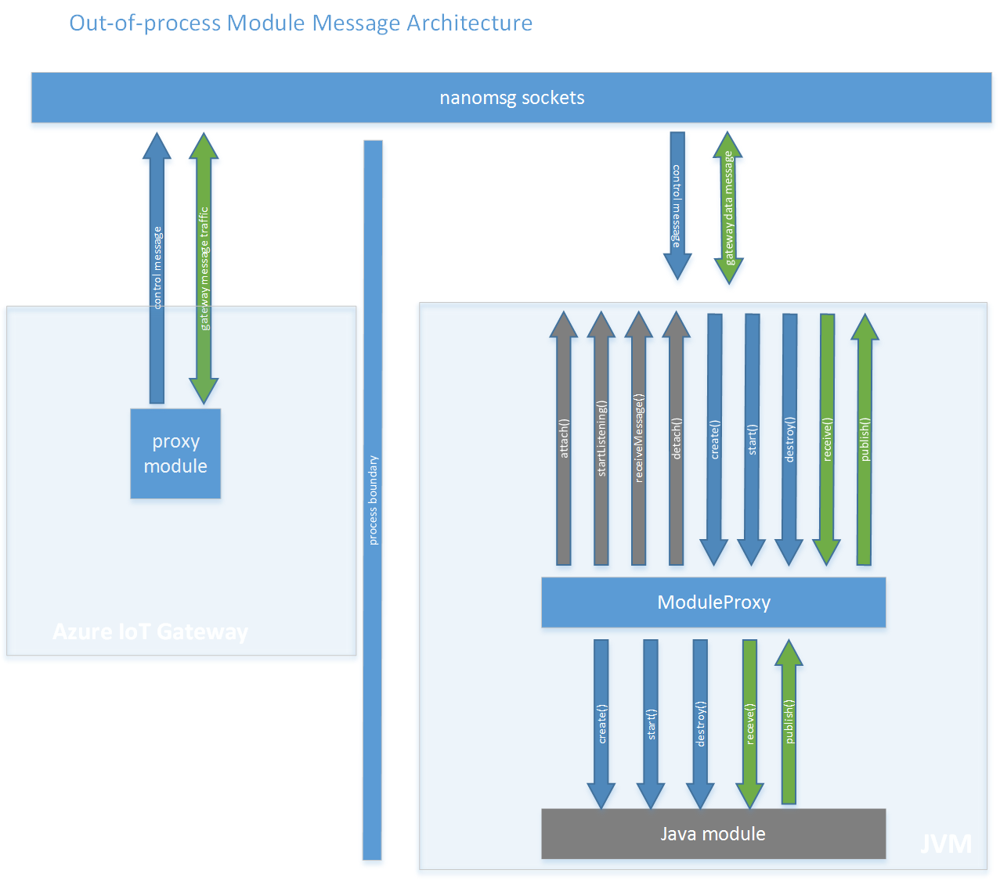

Java Out of Process Module API
==============================

Overview
--------

This document describes the API that enables communication between an out of process Java module and Azure IoT Gateway. 
An out of process module should implement `IGatewayModule` interface or extend the `GatewayModule` abstract class as it does for an in-process module, more details in [Java binding high level design](java_binding_hld.md). In addition, the API provides `ProxyGateway` which is a proxy for the IGatewayModule implementation and handles the communication between the Gateway and the out of process module. 
`ProxyGateway` contains the methods to *attach* a module to the Gateway which will start listening for messages and *detach* from the Gateway. 

There are two types of messages that are exchanged between the Gateway and the out of process module:

-  *control* messages that are used to signal `CREATE`, `START` and `DESTROY` of a module. These messages are always sent from the Gateway to the module.
-  *data* messages which are sent between modules via the Gateway.




Receive out of process messages from the Gateway
------------------------------------------------

In order to make a module to run out of process, create an instance of `ProxyGateway`, pass the configuration that contains the unique identifier to attach to the Gateway and then call `attach`. 
Also the Gateway configuration has to be changed for that specific module to set the loader as an out of process loader and set the same unique identifier. 

``` java
public class ProxyGateway {
	private ModuleConfiguration config;
	public ProxyGateway(ModuleConfiguration config) {
		// implementation
	}

	public void attach() {
		// implementation	
	}
	
	public void detach() {
		// implementation	
	}
}
```

Messages sequence
-----------------


The `attach` method from ProxyGateway shall be called to be able to start receiving messages from the Gateway. This method creates a thread that listens for incoming messages from the Gateway. 
`attach` is a non-blocking call, the thread that it starts shall continuously check for one message on each of the command and message channels. If multiple messages are queued on a channel, only the first message of each channel will be retrieved at every check.

The communication between the out of process module and the Gateway is done using *nanomsg* which is a socket library written in C and is going to be called from Java using JNI. 
The `ProxyGateway` abstracts the communication over *nanomsg* and the module receives the messages from the Gateway as an in-process module via `receive` method.

The first message that the module should receive from the Gateway is `CREATE`. When `CREATE` message is received `create` method from `IGatewayModule` implementation gets called. 

When the module receives a `START` message from the gateway it forwards to `start` method from IGatewayModule implementation .

All *data* messages are forwarded to the `receive` method from IGatewayModule implementation.

When the module doesn't want to receive or send messages from/to the gateway it should call `detach` method from ProxyGateway. The Gateway may send a `DESTROY` message that stops the listening thread and calls `destroy` method from IGatewayModule implementation.

``` java
public class ModuleConfiguration {
	private String identifier;
	private Class<? extends IGatewayModule> moduleClass;
    
	// implementation
}
```

`ModuleConfiguration` class contains the details required to attach to the Gateway: the identifier which is the unique id that must be the same as *outprocess_module_control_unique_id* used in the Gateway configuration of the module.
`moduleClass` represents the IGatewayModule implementation class.

Example how the loader should be configured in Gateway for out of process module:

``` json
"modules" : [
{ 
    "name" : "outprocess_module",
    "loader" : {
        "name" : "outprocess"
        "entrypoint" : {
            "activation.type" : "none",
            "control.id" : "outprocess_module_control_unique_id"
        }
    }
    "args" : {...}
}
]
```

Send out of process messages to the Gateway
-------------------------------------------

When the module method `create` gets called, one of the arguments is a broker object which can be used to send messages to the Gateway by calling `publishMessage`. 
For the out of process module a `BrokerProxy` instance is going to be passed as the broker argument which will handle sending messages to the out of process Gateway.